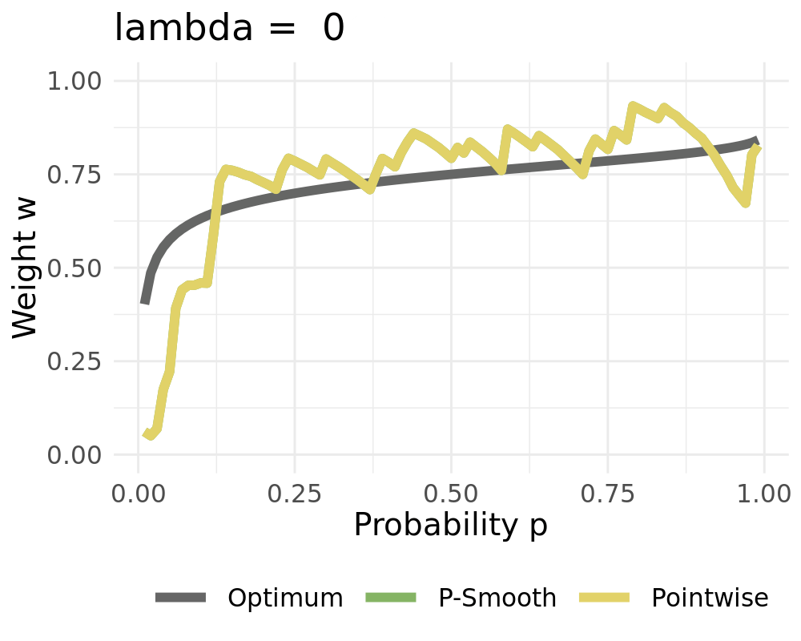
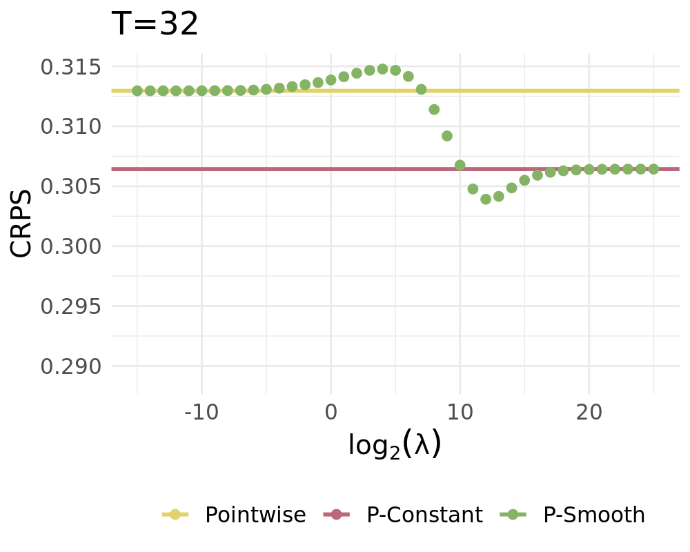
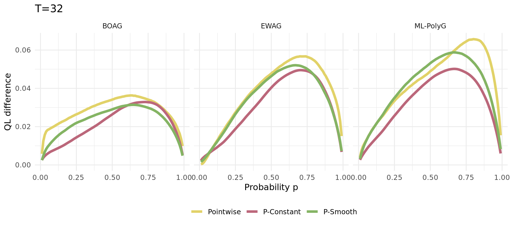
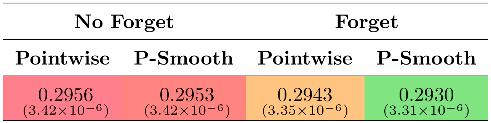

```{r, setup, include=FALSE}
# Compile with: rmarkdown::render("crps_learning.Rmd")
library(latex2exp)
library(ggplot2)
library(dplyr)
library(tidyr)
library(purrr)
library(kableExtra)
library(gt)
library(plotly)
knitr::opts_chunk$set(
  dev = "svglite" # Use svg figures
)
library(RefManageR)
BibOptions(
  check.entries = TRUE,
  bib.style = "authoryear",
  cite.style = "authoryear",
  style = "html",
  hyperlink = "to.doc",
  dashed = FALSE
)
my_bib <- ReadBib("assets/library.bib", check = FALSE)
col_lightgray <- "#e7e7e7"
col_blue <- "#000088"
col_smooth_expost <- "#a7008b"
col_smooth <- "#187a00"
col_pointwise <- "#008790"
col_constant <- "#dd9002"
col_optimum <- "#666666"

# https://www.schemecolor.com/sweeping-fall.php
col_green <- "#61B94C"
col_orange <- "#ffa600"
col_yellow <- "#FCE135"
```

```{r xaringan-panelset, echo=FALSE}
xaringanExtra::use_panelset()
```

```{r xaringanExtra-freezeframe, echo=FALSE}
xaringanExtra::use_freezeframe(responsive = TRUE)
```

name: motivation

# Motivation

.pull-left[

The Idea:
- Combine multiple forecasts instead of choosing one

- Combination weights may vary over **time**, over the **distribution** or **both**

2 Popular options for combining distributions:
- Combining across quantiles (this paper)
  - Horizontal aggregation, vincentization
- Combining across probabilities
  - Vertical aggregation

]

.pull-right[

<div style="position:relative; margin-top:-50px; z-index: 0">

.panelset[
.panel[.panel-name[Time]

```{r, echo = FALSE, fig.height=6, cache = FALSE}
par(mfrow = c(3, 3), mar = c(2, 2, 2, 2))
set.seed(1)
# Data
X <- matrix(ncol = 3, nrow = 15)
X[, 1] <- seq(from = 8, to = 12, length.out = 15) + 0.25 * rnorm(15)
X[, 2] <- 10 + 0.25 * rnorm(15)
X[, 3] <- seq(from = 12, to = 8, length.out = 15) + 0.25 * rnorm(15)
# Weights
w <- matrix(ncol = 3, nrow = 15)
w[, 1] <- sin(0.1 * 1:15)
w[, 2] <- cos(0.1 * 1:15)
w[, 3] <- seq(from = -2, 0.25, length.out = 15)^2
w <- (w / rowSums(w))
# Vis
plot(X[, 1],
  lwd = 4,
  type = "l",
  ylim = c(8, 12),
  xlab = "",
  ylab = "",
  xaxt = "n",
  yaxt = "n",
  bty = "n",
  col = "#2050f0"
)
plot(w[, 1],
  lwd = 4, type = "l",
  ylim = c(0, 1),
  xlab = "",
  ylab = "", xaxt = "n", yaxt = "n", bty = "n", col = "#2050f0"
)
text(6, 0.5, latex2exp::TeX("$w_1(t)$"), cex = 2, col = "#2050f0")
arrows(13, 0.25, 15, 0.0, , lwd = 4, bty = "n")
plot.new()
plot(X[, 2],
  lwd = 4,
  type = "l", ylim = c(8, 12),
  xlab = "", ylab = "", xaxt = "n", yaxt = "n", bty = "n", col = "purple"
)
plot(w[, 2],
  lwd = 4, type = "l",
  ylim = c(0, 1),
  xlab = "",
  ylab = "", xaxt = "n", yaxt = "n", bty = "n", col = "purple"
)
text(6, 0.6, latex2exp::TeX("$w_2(t)$"), cex = 2, col = "purple")
arrows(13, 0.5, 15, 0.5, , lwd = 4, bty = "n")
plot(rowSums(X * w), lwd = 4, type = "l", xlab = "", ylab = "", xaxt = "n", yaxt = "n", bty = "n", col = "#298829")
plot(X[, 3],
  lwd = 4,
  type = "l", ylim = c(8, 12),
  xlab = "", ylab = "", xaxt = "n", yaxt = "n", bty = "n", col = "#e423b4"
)
plot(w[, 3],
  lwd = 4, type = "l",
  ylim = c(0, 1),
  xlab = "",
  ylab = "", xaxt = "n", yaxt = "n", bty = "n", col = "#e423b4"
)
text(6, 0.25, latex2exp::TeX("w_3(t)"), cex = 2, col = "#e423b4")
arrows(13, 0.75, 15, 1, , lwd = 4, bty = "n")
```

]

.panel[.panel-name[Distribution]
```{r, echo = FALSE, fig.height=6, cache = FALSE}
par(mfrow = c(3, 3), mar = c(2, 2, 2, 2))
set.seed(1)
# Data
X <- matrix(ncol = 3, nrow = 31)

X[, 1] <- dchisq(0:30, df = 10)
X[, 2] <- dnorm(0:30, mean = 15, sd = 5)
X[, 3] <- dexp(0:30, 0.2)
# Weights
w <- matrix(ncol = 3, nrow = 31)
w[, 1] <- sin(0.05 * 0:30)
w[, 2] <- cos(0.05 * 0:30)
w[, 3] <- seq(from = -2, 0.25, length.out = 31)^2
w <- (w / rowSums(w))
# Vis
plot(X[, 1],
  lwd = 4,
  type = "l",
  xlab = "",
  ylab = "",
  xaxt = "n",
  yaxt = "n",
  bty = "n",
  col = "#2050f0"
)
plot(X[, 2],
  lwd = 4,
  type = "l",
  xlab = "", ylab = "", xaxt = "n", yaxt = "n", bty = "n", col = "purple"
)
plot(X[, 3],
  lwd = 4,
  type = "l",
  xlab = "", ylab = "", xaxt = "n", yaxt = "n", bty = "n", col = "#e423b4"
)
plot(w[, 1],
  lwd = 4, type = "l",
  ylim = c(0, 1),
  xlab = "",
  ylab = "", xaxt = "n", yaxt = "n", bty = "n", col = "#2050f0"
)
text(12, 0.5, latex2exp::TeX("$w_1(x)$"), cex = 2, col = "#2050f0")
arrows(26, 0.25, 31, 0.0, , lwd = 4, bty = "n")
plot(w[, 2],
  lwd = 4, type = "l",
  ylim = c(0, 1),
  xlab = "",
  ylab = "", xaxt = "n", yaxt = "n", bty = "n", col = "purple"
)
text(15, 0.5, latex2exp::TeX("$w_2(x)$"), cex = 2, col = "purple")
arrows(15, 0.25, 15, 0, , lwd = 4, bty = "n")
plot(w[, 3],
  lwd = 4, type = "l",
  ylim = c(0, 1),
  xlab = "",
  ylab = "", xaxt = "n", yaxt = "n", bty = "n", col = "#e423b4"
)
text(20, 0.5, latex2exp::TeX("$w_3(x)$"), cex = 2, col = "#e423b4")
arrows(5, 0.25, 0, 0, , lwd = 4, bty = "n")
plot.new()
plot(rowSums(X * w), lwd = 4, type = "l", xlab = "", ylab = "", xaxt = "n", yaxt = "n", bty = "n", col = "#298829")
```

]]
]

---

name: pred_under_exp_advice

# The Framework of Prediction under Expert Advice

### The sequential framework

.pull-left[

Each day, $t = 1, 2, ... T$
- The **forecaster** receives predictions $\widehat{X}_{t,k}$ from $K$ **experts**
- The **forecaster** assings weights $w_{t,k}$ to each **expert**
- The **forecaster** calculates her prediction:
\begin{equation}
    \widetilde{X}_{t} = \sum_{k=1}^K w_{t,k} \widehat{X}_{t,k}.
    \label{eq_forecast_def}
\end{equation}
- The realization for $t$ is observed
]

.pull-left[

- The experts can be institutions, persons, or models
- The forecasts can be point-forecasts (i.e., mean or median) or full predictive distributions
- We do not need any assumptions concerning the underlying data
- `r Citet(my_bib, "cesa2006prediction")`

]

---

name: regret
  
# The Regret

Weights are updated sequentially according to the past performance of the $K$ experts.

`r fontawesome::fa("arrow-right", fill ="#000000")` A loss function $\ell$ is needed (to compute the **cumulative regret** $R_{t,k}$)

\begin{equation}
    R_{t,k}  = \widetilde{L}_{t} - \widehat{L}_{t,k} =  \sum_{i = 1}^t \ell(\widetilde{X}_{i},Y_i) - \ell(\widehat{X}_{i,k},Y_i)
    \label{eq_regret}
\end{equation}

The cumulative regret:
- Indicates the predictive accuracy of the expert $k$ until time $t$.
- Measures how much the forecaster *regrets* not having followed the expert's advice

Popular loss functions for point forecasting `r Citet(my_bib, "gneiting2011making")`:
.pull-left[
- $\ell_2$-loss $\ell_2(x, y) = | x -y|^2$
  - optimal for mean prediction 
]
.pull-right[
- $\ell_1$-loss $\ell_1(x, y) = | x -y|$ 
  - optimal for median predictions 
]

---

name: popular_algs

# Popular Algorithms and the Risk

.pull-left[

### Popular Aggregation Algorithms

#### The naive combination

\begin{equation}
    w_{t,k}^{\text{Naive}} = \frac{1}{K}
\end{equation}

#### The exponentially weighted average forecaster (EWA)

\begin{align}
    w_{t,k}^{\text{EWA}} & = \frac{e^{\eta R_{t,k}} }{\sum_{k = 1}^K e^{\eta R_{t,k}}}
    =
    \frac{e^{-\eta \ell(\widehat{X}_{t,k},Y_t)} w^{\text{EWA}}_{t-1,k} }{\sum_{k = 1}^K e^{-\eta \ell(\widehat{X}_{t,k},Y_t)} w^{\text{EWA}}_{t-1,k} }
    \label{eq_ewa_general}
\end{align}

]

.pull-right[

### Optimality

In stochastic settings, the cumulative Risk should be analyzed `r Citet(my_bib, "wintenberger2017optimal")`:
\begin{align}
    &\underbrace{\widetilde{\mathcal{R}}_t = \sum_{i=1}^t \mathbb{E}[\ell(\widetilde{X}_{i},Y_i)|\mathcal{F}_{i-1}]}_{\text{Cumulative Risk of Forecaster}} \\
    &\underbrace{\widehat{\mathcal{R}}_{t,k} = \sum_{i=1}^t \mathbb{E}[\ell(\widehat{X}_{i,k},Y_i)|\mathcal{F}_{i-1}]}_{\text{Cumulative Risk of Experts}}
    \label{eq_def_cumrisk}
\end{align}

]

---

# Optimal Convergence

.pull-left[

### The selection problem
\begin{equation}
    \frac{1}{t}\left(\widetilde{\mathcal{R}}_t - \widehat{\mathcal{R}}_{t,\min} \right) \stackrel{t\to \infty}{\rightarrow} a \quad \text{with} \quad a \leq 0.
    \label{eq_opt_select}
\end{equation}
The forecaster is asymptotically not worse than the best expert $\widehat{\mathcal{R}}_{t,\min}$.

### The convex aggregation problem

\begin{equation}
    \frac{1}{t}\left(\widetilde{\mathcal{R}}_t - \widehat{\mathcal{R}}_{t,\pi} \right) \stackrel{t\to \infty}{\rightarrow} b \quad \text{with} \quad b \leq 0 .
    \label{eq_opt_conv}
\end{equation}
The forecaster is asymptotically not worse than the best convex combination $\widehat{X}_{t,\pi}$ in hindsight (**oracle**).
]

.pull-right[

Optimal rates with respect to selection \eqref{eq_opt_select} and convex aggregation \eqref{eq_opt_conv}  `r Citet(my_bib, "wintenberger2017optimal")`: 

\begin{align}
    \frac{1}{t}\left(\widetilde{\mathcal{R}}_t - \widehat{\mathcal{R}}_{t,\min} \right) & =
    \mathcal{O}\left(\frac{\log(K)}{t}\right)\label{eq_optp_select}
\end{align}
\begin{align}
    \frac{1}{t}\left(\widetilde{\mathcal{R}}_t - \widehat{\mathcal{R}}_{t,\pi} \right)  & =
    \mathcal{O}\left(\sqrt{\frac{\log(K)}{t}}\right)
    \label{eq_optp_conv}
\end{align}

Algorithms can statisfy both \eqref{eq_optp_select} and \eqref{eq_optp_conv} depending on:

- The loss function
- Regularity conditions on $Y_t$ and $\widehat{X}_{t,k}$
- The weighting scheme

]

---

name:crps

.pull-left[

## Probabilistic Setting

An appropriate loss:

\begin{align*}
    \text{CRPS}(F, y) & = \int_{\mathbb{R}} {(F(x) - \mathbb{1}\{ x > y \})}^2 dx
    \label{eq_crps}
\end{align*}

It's strictly proper `r Citet(my_bib, "gneiting2007strictly")`.

Using the CRPS, we can calculate time-adaptive weights $w_{t,k}$. However, what if the experts' performance varies in parts of the distribution? 

`r fontawesome::fa("lightbulb", fill = col_yellow)` Utilize this relation:

\begin{align*}
    \text{CRPS}(F, y) = 2 \int_0^{1}  \text{QL}_p(F^{-1}(p), y) \, d p.
    \label{eq_crps_qs}
\end{align*}

... to combine quantiles of the probabilistic forecasts individually using the quantile-loss QL.

]

.pull-right[

## Optimal Convergence

`r fontawesome::fa("exclamation", fill = col_orange)` exp-concavity of the loss is required for \eqref{eq_optp_select} and \eqref{eq_optp_conv} 

`r fontawesome::fa("exclamation", fill = col_orange)` QL is convex, but not exp-concave 

`r fontawesome::fa("arrow-right", fill ="#000000")` The Bernstein Online Aggregation (BOA) lets us weaken the exp-concavity condition.

Convergence rates of BOA are:

`r fontawesome::fa("arrow-right", fill ="#000000")` Almost optimal w.r.t *selection* \eqref{eq_optp_select} `r Citet(my_bib, "gaillard2018efficient")`.

`r fontawesome::fa("arrow-right", fill ="#000000")` Almost optimal w.r.t *convex aggregation* \eqref{eq_optp_conv} `r Citet(my_bib, "wintenberger2017optimal")`.

]

---

name: simple_example

# A Probabilistic Example

.pull-left[

Simple Example:

\begin{align}
    Y_t               & \sim \mathcal{N}(0,\,1)                     \\
    \widehat{X}_{t,1} & \sim \widehat{F}_{1}  = \mathcal{N}(-1,\,1) \\
    \widehat{X}_{t,2} & \sim \widehat{F}_{2}  = \mathcal{N}(3,\,4)
    \label{eq:dgp_sim1}
\end{align}

- True weights vary over $p$
- Figures show the ECDFs and calculated weights using $T=25$ realizations
- Pointwise is better than constant
- Pointwise solution creates rough estimates

We propose 2 smoothing procedures: 
- **P-Spline smoothing** upcoming slides
- Basis smoothing `r Citet(my_bib, "BERRISCH2021")` 3.2
]

.pull-right[

<div style="position:relative; margin-top:-50px; z-index: 0">

.panelset[
.panel[.panel-name[CDFs]

```{r, echo = FALSE, fig.width=7, fig.height=6, fig.align='center', cache = FALSE}
load("data_plot.rds")

data_plot + theme(
  text = element_text(size = 20),
)
```

]

.panel[.panel-name[Weights]

```{r, echo = FALSE, fig.width=7, fig.height=6, fig.align='center', cache = FALSE}
load("weights_plot.rds")

weights_plot + theme(
  text = element_text(size = 20),
)
```

]
]]

---
    
# The P-Smooth Procedure

.pull-left[

Penalized cubic B-Splines for smoothing weights:

Let $\varphi=(\varphi_1,\ldots, \varphi_L)$ be bounded basis functions on $(0,1)$ Then we approximate $w_{t,k}$ by

\begin{align}
w_{t,k}^{\text{smooth}} = \sum_{l=1}^L \beta_l \varphi_l = \beta'\varphi
\end{align}

with parameter vector $\beta$. The latter is estimated penalized $L_2$-smoothing which minimizes

\begin{equation}
    \| w_{t,k} - \beta' \varphi  \|^2_2 + \lambda \| \mathcal{D}^{d}  (\beta' \varphi)  \|^2_2
    \label{eq_function_smooth}
\end{equation}

with differential operator $\mathcal{D}$

Computation is easy, since we have an analytical solution

]

.pull-right[

We receive the constant solution for high values of $\lambda$ when setting $d=1$

<center>

</center>

]

---

name: simulation

# Simulation Study

.pull-left[

Data Generating Process of the [simple probabilistic example](#simple_example)

- Constant solution $\lambda \rightarrow \infty$
- Pointwise Solution of the proposed BOAG
- Smoothed Solution of the proposed BOAG
  - Weights are smoothed during learning
  - Smooth weights are used to calculate Regret, adjust weights, etc. 

]

.pull-right[

<div style="position:relative; margin-top:-50px; z-index: 0">

.panelset[
.panel[.panel-name[QL Deviation]

Deviation from best attainable $\boldsymbol{QL}_\boldsymbol{\mathcal{P}}$ (1000 runs). 


]

.panel[.panel-name[Lambda]

CRPS Values for different $\lambda$ (1000 runs)



]]]

---

# Simulation Study

The same simulation carried out for different algorithms (1000 runs):

<center>

</center>

---

# Simulation Study

.pull-left-1[

**New DGP:**

\begin{align}
    Y_t               & \sim \mathcal{N}\left(\frac{\sin(0.005 \pi t )}{2},\,1\right) \\
    \widehat{X}_{t,1} & \sim      \widehat{F}_{1}  = \mathcal{N}(-1,\,1)              \\
    \widehat{X}_{t,2} & \sim       \widehat{F}_{2}  = \mathcal{N}(3,\,4) \label{eq_dgp_sim2}
\end{align}

`r fontawesome::fa("arrow-right", fill ="#000000")` Changing optimal weights

`r fontawesome::fa("arrow-right", fill ="#000000")` Single run example depicted aside

`r fontawesome::fa("arrow-right", fill ="#000000")` No forgetting leads to long-term constant weights

<center>

</center>

]

.pull-right-2[

**Weights of expert 2**

```{r, echo = FALSE, fig.width=7, fig.height=5, fig.align='center', cache = FALSE}
load("03_example_forget.rds")
plot
```

]

---

name:extensions

# Possible Extensions

.pull-left[

**Forgetting**

- Only taking part of the old cumulative regret into account
- Exponential forgetting of past regret

\begin{align*}
    R_{t,k} & =  R_{t-1,k}(1-\xi) + \ell(\widetilde{F}_{t},Y_i) - \ell(\widehat{F}_{t,k},Y_i) \label{eq_regret_forget}
\end{align*}

**Fixed Shares** `r Citet(my_bib, "herbster1998tracking")`

  - Adding fixed shares to the weights
  - Shrinkage towards a constant solution

\begin{align*}
    \widetilde{w}_{t,k} = \rho \frac{1}{K} + (1-\rho) w_{t,k}
    \label{fixed_share_simple}.
\end{align*}

]

.pull-right[

**Non-Equidistant Knots**
- Important regions can receive more knots
- Destroys shrinkage towards constant
- Profoc utilizes the beta distribution to create knots

```{r, echo = FALSE, fig.width=13, fig.height=5.5, fig.align='center', cache = FALSE}
# remotes::install_github("berrij/profoc@uneven_grid")
# library(profoc)
# library(gganimate)
# library(dplyr)
# library(tidyr)

# basis <- NULL
# x <- seq(0.01, 0.99, 0.01)

# for (a in seq(0.3, 1.8, by = 0.1)) {
#   deg <- 3
#   knots <- profoc:::make_knots(0.1, a, deg)
#   basis_temp <- splines::splineDesign(knots, x, deg + 1, 0, TRUE)
#   basis_temp %>%
#     as_tibble() %>%
#     mutate(
#       index = x,
#       a = a
#     ) %>%
#     pivot_longer(!all_of(c("a", "index"))) -> basis_temp

#   basis <- rbind(basis, basis_temp)
# }


# ggplot(basis, aes(x = index, y = value, col = name)) +
#   geom_line(size = 2) +
#   theme_minimal() +
#   theme(legend.position = "none") +
#   xlab(NULL) +
#   ylab(NULL) -> plot

# anim <- plot +
#   transition_states(a,
#     transition_length = 3,
#     state_length = 5,
#     wrap = FALSE
#   ) +
#   ggtitle("Evenness Parameter =  {next_state}")

# animation <- animate(anim,
#   nframes = 350,
#   start_pause = 10,
#   end_pause = 10,
#   height = 2.5,
#   width = 5,
#   units = "in",
#   res = 200,
#   rewind = FALSE,
#   renderer = gifski_renderer("presentations/21_05_france/uneven_grid.gif")
# )
```

<center>

</center>

]

---

name: application

# Application Study: Overview

.pull-left-1[

.font90[

Data:

- Forecasting European emission allowances (EUA)
- Daily month-ahead prices 
- Jan 13 - Dec 20 (Phase III, 2092 Obs)

Combination methods:

- Naive, BOAG, EWAG, ML-PolyG, BMA

Tuning paramter grids:

- Smoothing Penalty: $\Lambda= \{0\}\cup \{2^x|x\in \{-4,-3.5,\ldots,12\}\}$
- Learning Rates: $\mathcal{E}= \{2^x|x\in \{-1,-0.5,\ldots,9\}\}$

]
] 

.pull-right-2[

```{r, echo = FALSE, fig.width=7, fig.height=5, fig.align='center', cache = FALSE}
load("overview_data.rds")

data %>%
  ggplot(aes(x = Date, y = value)) +
  geom_line(size = 1, col = col_blue) +
  theme_minimal() +
  ylab("Value") +
  facet_wrap(. ~ name, scales = "free", ncol = 1) +
  theme(
    text = element_text(size = 15),
    strip.background = element_blank(),
    strip.text.x = element_blank()
  ) -> p1

data %>%
  ggplot(aes(x = value)) +
  geom_histogram(aes(y = ..density..), size = 1, fill = col_blue, bins = 50) +
  ylab("Density") +
  xlab("Value") +
  theme_minimal() +
  theme(
    strip.background = element_rect(fill = col_lightgray, colour = col_lightgray),
    text = element_text(size = 15)
  ) +
  facet_wrap(. ~ name, scales = "free", ncol = 1, strip.position = "right") -> p2

overview <- cowplot::plot_grid(plotlist = list(p1, p2), align = "hv", axis = "tblr", rel_widths = c(0.65, 0.35))
overview
```

]

---

# Application Study: Experts

.font90[

Simple exponential smoothing with additive errors (**ETS-ANN**):

\begin{align*}
Y_{t} = l_{t-1} + \varepsilon_t \quad \text{with} \quad l_t = l_{t-1} + \alpha \varepsilon_t \quad \text{and} \quad \varepsilon_t \sim \mathcal{N}(0,\sigma^2)
\end{align*}

Quantile regression (**QuantReg**): For each $p \in \mathcal{P}$ we assume:

\begin{align*}
F^{-1}_{Y_t}(p) = \beta_{p,0} + \beta_{p,1} Y_{t-1} + \beta_{p,2} |Y_{t-1}-Y_{t-2}|
\end{align*}

ARIMA(1,0,1)-GARCH(1,1) with Gaussian errors (**ARMA-GARCH**):

\begin{align*}
Y_{t} = \mu + \phi(Y_{t-1}-\mu) + \theta \varepsilon_{t-1} + \varepsilon_t \quad \text{with} \quad \varepsilon_t = \sigma_t Z, \quad \sigma_t^2 = \omega + \alpha \varepsilon_{t-1}^2 + \beta \sigma_{t-1}^2 \quad \text{and} \quad Z_t \sim \mathcal{N}(0,1)
\end{align*}

ARIMA(0,1,0)-I-EGARCH(1,1) with Gaussian errors (**I-EGARCH**):

\begin{align*}
Y_{t} = \mu + Y_{t-1}  + \varepsilon_t \quad \text{with} \quad \varepsilon_t = \sigma_t Z, \quad \log(\sigma_t^2) = \omega + \alpha Z_{t-1}+ \gamma (|Z_{t-1}|-\mathbb{E}|Z_{t-1}|) + \beta \log(\sigma_{t-1}^2) \quad \text{and} \quad Z_t \sim \mathcal{N}(0,1)
\end{align*}

ARIMA(0,1,0)-GARCH(1,1) with student-t errors (**I-GARCHt**}):

\begin{align*}
Y_{t} = \mu + Y_{t-1}  + \varepsilon_t \quad \text{with} \quad \varepsilon_t = \sigma_t Z, \quad \sigma_t^2 = \omega + \alpha \varepsilon_{t-1}^2 + \beta \sigma_{t-1}^2 \quad \text{and} \quad Z_t \sim t(0,1, \nu)
\end{align*}

]

---

# Application Study: Results

<div style="position:relative; margin-top:-25px; z-index: 0">

.panelset[

.panel[.panel-name[Significance]

```{r, echo = FALSE, fig.width=7, fig.height=5.5, fig.align='center', cache = FALSE, results='asis'}
# load("../../application_study_newlog4.RData")
load("../../application_study_estimations+learnings.RData")

## quantile loss of forecasts:
quantile_loss <- function(X, y, tau) {
  t(t(y - X) * tau) * (y - X > 0) + t(t(X - y) * (1 - tau)) * (y - X < 0)
}
QL <- FCSTN * NA
for (k in 1:dim(QL)[1]) {
  QL[k, , ] <- quantile_loss(FCSTN[k, , ], yoos, Qgrid)
}

## TABLE AREA

KK <- length(mnames)
TTinit <- 1 ## without first, as all comb. are uniform
RQL <- apply(QL[1:KK, -c(1:TTinit), ], c(1, 3), mean)
dimnames(RQL) <- list(mnames, Qgrid)
RQLm <- apply(RQL, c(1), mean, na.rm = TRUE)
##
qq <- apply(QL[1:KK, -c(1:TTinit), ], c(1, 2), mean)

Pall <- numeric(KK)
for (i in 1:KK) Pall[i] <- t.test(qq[K + 1, ] - qq[i, ], alternative = "greater")$p.val

Mall <- (RQLm - RQLm[K + 1]) * 10000
Mout <- matrix(Mall[-c(1:(K + 1))], 4, 4)
dimnames(Mout) <- list(moname, mtname)

Pallout <- format(round(Pall, 3), nsmall = 3)
Pallout[Pallout == "0.000"] <- "<.001"
Pallout[Pallout == "1.000"] <- ">.999"

MO <- K
OUT <- t(Mall[1:K])
OUT.num <- OUT
class(OUT.num) <- "numeric"

xxx <- OUT.num
table <- OUT
table_col <- OUT

i.p <- 1
for (i.p in 1:MO) {
  xmax <- -min(Mall) * 5 # max(Mall)
  xmin <- min(Mall)
  cred <- rev(c(1, 1, 1, 1, 1, 1, 1, 1, 1, 1, 1, 1, .8, .5)) # , .5,0,0,0,1,1,1) ## red
  cgreen <- rev(c(.5, .5, .55, .6, .65, .7, .75, .8, .85, .9, .95, 1, 1, .9)) # , .5,0,1,1,1,0,0) ## green
  cblue <- rev(c(.55, .5, .5, .5, .5, .5, .5, .5, .5, .5, .5, .5, .5, .5)) # , .5,1,1,0,0,0,1) ## blue
  crange <- c(xmin, xmax) ## range
  ## colors in plot:
  fred <- round(approxfun(seq(crange[1], crange[2], length = length(cred)), cred)(pmin(xxx[, i.p], xmax)), 3)
  fgreen <- round(approxfun(seq(crange[1], crange[2], length = length(cgreen)), cgreen)(pmin(xxx[, i.p], xmax)), 3)
  fblue <- round(approxfun(seq(crange[1], crange[2], length = length(cblue)), cblue)(pmin(xxx[, i.p], xmax)), 3)
  tmp <- format(round(xxx[, i.p], 3), nsmall = 3)
  table[, i.p] <- paste0(tmp, " (", Pallout[i.p], ")")
  table_col[, i.p] <- rgb(fred, fgreen, fblue, maxColorValue = 1)
  # paste("\\cellcolor[rgb]{", fred, ",", fgreen, ",", fblue, "}", tmp, " {\\footnotesize  (", Pallout[i.p], ")}", sep = "")
} # i.p

table_out <- kbl(table, align = rep("c", ncol(table)))

for (cols in 1:ncol(table)) {
  table_out <- table_out %>%
    column_spec(cols, background = table_col[, cols])
}
table_out %>%
  kable_material()

##
MO <- 4
OUT <- Mout
OUT.num <- OUT
class(OUT.num) <- "numeric"

xxx <- OUT.num
table2 <- OUT
table_col2 <- OUT
i.p <- 1
for (i.p in 1:MO) {
  xmax <- -min(Mall) * 5 # max(Mall)
  xmin <- min(Mall)
  cred <- rev(c(1, 1, 1, 1, 1, 1, 1, 1, 1, 1, 1, 1, .8, .5)) # , .5,0,0,0,1,1,1) ## red
  cgreen <- rev(c(.5, .5, .55, .6, .65, .7, .75, .8, .85, .9, .95, 1, 1, .9)) # , .5,0,1,1,1,0,0) ## green
  cblue <- rev(c(.55, .5, .5, .5, .5, .5, .5, .5, .5, .5, .5, .5, .5, .5)) # , .5,1,1,0,0,0,1) ## blue
  crange <- c(xmin, xmax) ## range
  ## colors in plot:
  fred <- round(approxfun(seq(crange[1], crange[2], length = length(cred)), cred)(pmin(xxx[, i.p], xmax)), 3)
  fgreen <- round(approxfun(seq(crange[1], crange[2], length = length(cgreen)), cgreen)(pmin(xxx[, i.p], xmax)), 3)
  fblue <- round(approxfun(seq(crange[1], crange[2], length = length(cblue)), cblue)(pmin(xxx[, i.p], xmax)), 3)
  tmp <- format(round(xxx[, i.p], 3), nsmall = 3)
  # xxxx[, i.p] <- paste("\\cellcolor[rgb]{", fred, ",", fgreen, ",", fblue, "}", tmp, " {\\footnotesize $ (", Pallout[K + 1 + MO * (i.p - 1) + 1:MO], ")$}", sep = "")
  table2[, i.p] <- paste0(tmp, " (", Pallout[K + 1 + MO * (i.p - 1) + 1:MO], ")")
  table_col2[, i.p] <- rgb(fred, fgreen, fblue, maxColorValue = 1)
} # i.p

table_out2 <- kbl(table2, align = rep("c", ncol(table2)))

for (cols in 1:ncol(table2)) {
  table_out2 <- table_out2 %>%
    column_spec(1 + cols,
      background = table_col2[, cols]
    )
}

table_out2 %>%
  kable_material() %>%
  column_spec(1, bold = T)
```


CRPS difference to **Naive** (scaled by $10^4$) of single experts and four combination methods with four options.
Additionally, we show the p-value of the DM-test, testing against **Naive**. The smallest value is bold. We also report the optimal ex-post selection by **smooth***

]

.panel[.panel-name[QL]

```{r, echo = FALSE, fig.width=13, fig.height=5.5, fig.align='center', cache = FALSE, warning = FALSE, message = FALSE}

##### Performance across probabilities

M <- length(mnames)
Msel <- c(1:K, K + 1, K + 1 + 1:4 * 4 - 2) ## experts + naive + smooth
modnames <- mnames[Msel]

tCOL <- c(
  "#CC9900", "#994D00", "#E61A1A", "#99004D", "#E61AB3", "#666666", "#0000CC", "#0080E6",
  "#00E680", "#00CC00"
)


t(RQL) %>%
  as_tibble() %>%
  select(Naive) %>%
  mutate(Naive = 0) %>%
  mutate(p = 1:99 / 100) %>%
  pivot_longer(-p, values_to = "Loss differences") -> dummy

data <- t(RQL) %>%
  as_tibble() %>%
  select(mnames[Msel]) %>%
  rename_all(funs(c(tname))) %>%
  mutate(p = 1:99 / 100) %>%
  pivot_longer(!p & !Naive) %>%
  mutate(`Loss differences` = value - Naive) %>%
  select(-value, -Naive) %>%
  rbind(dummy) %>%
  mutate(
    p = as.numeric(p),
    name = factor(name, levels = tname, ordered = T),
    `Loss differences` = `Loss differences` * 1000
  ) %>%
  ggplot(aes(x = p, y = `Loss differences`, colour = name)) +
  geom_line(size = 1) +
  theme_minimal() +
  theme(
    text = element_text(size = 15),
    legend.position = "bottom"
  ) +
  xlab("Probability p") +
  scale_color_manual(NULL, values = tCOL) +
  guides(colour = guide_legend(nrow = 2, byrow = TRUE)) -> diffs_to_naive
diffs_to_naive

##### Performance (cum.loss-difference to uniform) across time
```

]

.panel[.panel-name[Cumulative Loss Difference]

```{r, echo = FALSE, fig.width=13, fig.height=5.5, fig.align='center', cache = FALSE}
DQL <- t(apply(apply(QL[1:KK, -c(1:TTinit), ], c(1, 2), mean), 1, cumsum))

rownames(DQL) <- mnames

t(DQL) %>%
  as_tibble() %>%
  select(Naive) %>%
  mutate(
    `Difference of cumulative loss` = 0,
    Date = ytime[-c(1:(TT + TTinit + 1))],
    name = "Naive"
  ) %>%
  select(-Naive) -> dummy


data <- t(DQL) %>%
  as_tibble() %>%
  select(mnames[Msel]) %>%
  rename_all(funs(c(tname))) %>%
  mutate(Date = ytime[-c(1:(TT + TTinit + 1))]) %>%
  pivot_longer(!Date & !Naive) %>%
  mutate(`Difference of cumulative loss` = value - Naive) %>%
  select(-value, -Naive) %>%
  rbind(dummy) %>%
  mutate(
    name = factor(name, levels = tname, ordered = T),
    `Difference of cumulative loss` = `Difference of cumulative loss`
  ) %>%
  ggplot(aes(x = Date, y = `Difference of cumulative loss`, colour = name)) +
  geom_line(size = 1) +
  theme_minimal() +
  theme(
    text = element_text(size = 15),
    legend.position = "bottom"
  ) +
  scale_color_manual(NULL, values = tCOL) +
  guides(colour = guide_legend(nrow = 2, byrow = TRUE)) -> cum_diff_to_naive
cum_diff_to_naive
```

.panel[.panel-name[Weights]
```{r, echo = FALSE, fig.width=13, fig.height=5.5, fig.align='center', cache = FALSE}
mm <- mnames[1:K] # [-3]

pmod <- boag_smooth # learner to plot

source("../../functions/00_functions.R")

array_branch(pmod$weights, 2) %>%
  map2(mm, .f = ~ process_weights(.x,
    T = 1842,
    prob_grid = 1:99 / 100,
    name = .y,
    Dates = ytime[-c(1:(TT))]
  )) %>%
  reduce(.f = rbind) %>%
  group_by(p, Mod) %>%
  complete(Date = seq.Date(min(Date), max(Date), by = "day")) %>%
  fill(everything(), .direction = "downup") %>%
  ungroup() %>%
  mutate(Mod = factor(Mod, levels = mm, ordered = T)) -> weights_data


colseq <- c(grey(.99), "orange", "red", "purple", "blue", "darkblue", "black")

weights_data %>%
  ggplot(aes(Date, p, fill = w)) +
  geom_raster(interpolate = TRUE) +
  facet_grid(Mod ~ .) +
  theme_minimal() +
  theme(
    plot.margin = unit(c(0.2, 0.2, 0.2, 0.2), "cm"),
    text = element_text(size = 15),
    legend.key.height = unit(0.9, "inch")
  ) +
  ylab("Weight w") +
  scale_fill_gradientn(
    limits = c(0, 1),
    colours = colseq,
    breaks = seq(0, 1, 0.2)
  ) +
  scale_x_date(expand = c(0, 0)) -> weights_plot_col

weights_plot_col
```
]

]]

---

name: application

# Application to Multivariate Settings


.pull-left[

Apply BOA to (24 dimensional) day-ahead power forecasts

Forecasts from probabilistic neural networks:

Pre-Print to be released soon: Grzegorz Marcjasz, Michał Narajewski, Rafał Weron and Florian Ziel

```{r, echo = TRUE, eval = FALSE, fig.width=7, fig.height=5, fig.align='center', cache = FALSE}
# 182 obs as burn-in
mod <- online(
  y = Y, # 736 x 24
  experts = experts, # 736, 24, 99, 2
  tau = 1:99 / 100
)
```

```{r, echo = FALSE, fig.width=7, fig.height=5, fig.align='left', cache = FALSE}
tibble("norm" = 1.448, "jsu" = 1.372, "comb" = 1.334) %>%
  gt() %>%
  tab_header("CRPS Values")
```

]

.pull-right[

<div style="position:relative; margin-top:50px; z-index: 0">

```{r, echo = FALSE, fig.width=7, fig.height=7, fig.align='left', cache = FALSE}
load("epf_simple.rds")
fig
```

]

---

# Smoothing in Multivariate Setting

.pull-left[

Smoothing parameters can be optimized online

Below parameters chosen for illustrative purposes

```{r, echo = TRUE, eval = FALSE, fig.width=7, fig.height=5, fig.align='center', cache = FALSE}
mod <- online(
  y = Y,
  experts = experts,
  tau = 1:99 / 100,
  p_smooth_pr = list(
    lambda = c(20, 50, 100) # 50 selected
  ),
  p_smooth_mv = list(
    lambda = c(20, 50, 100) # 50 selected
  )
)
```

```{r, echo = FALSE, fig.width=7, fig.height=5, fig.align='left', cache = FALSE}
tibble("norm" = 1.448, "jsu" = 1.372, "comb" = 1.333) %>%
  gt() %>%
  tab_header("CRPS Values")
```

]

.pull-right[

<div style="position:relative; margin-top:50px; z-index: 0">

```{r, echo = FALSE, fig.width=7, fig.height=7, fig.align='left', cache = FALSE}
load("epf_smooth.rds")
fig
```
]

---

name: conclusion

# Wrap-Up

.font90[

.pull-left[

Potential Downsides:
- Pointwise optimization can induce quantile crossing
  - Can be solved by sorting the predictions

Upsides:
- Pointwise learning outperforms the Naive solution significantly
- Online learning is much faster than batch methods
- Smoothing further improves the predictive performance
- Asymptotically not worse than the best convex combination

]

.pull-left[

Important:
- The choice of the learning rate is crucial
- The loss function has to meet certain criteria

The [`r fontawesome::fa("github")` profoc](https://profoc.berrisch.biz/) R Package:

- Implements all algorithms discussed above
- Is written using RcppArmadillo `r fontawesome::fa("arrow-right", fill ="#000000")` its fast
- Accepts vectors for most parameters
  - Best parameter combination chosen online
- Implements 
  - Forgetting, Fixed Share
  - Different loss functions + gradients
  - Multivariate Inputs

]
]

<a href="https://github.com/BerriJ" class="github-corner" aria-label="View source on Github"><svg width="80" height="80" viewBox="0 0 250 250" style="fill:#f2f2f2; color:#212121; position: absolute; top: 0; border: 0; right: 0;" aria-hidden="true"><path d="M0,0 L115,115 L130,115 L142,142 L250,250 L250,0 Z"></path><path d="M128.3,109.0 C113.8,99.7 119.0,89.6 119.0,89.6 C122.0,82.7 120.5,78.6 120.5,78.6 C119.2,72.0 123.4,76.3 123.4,76.3 C127.3,80.9 125.5,87.3 125.5,87.3 C122.9,97.6 130.6,101.9 134.4,103.2" fill="currentColor" style="transform-origin: 130px 106px;" class="octo-arm"></path><path d="M115.0,115.0 C114.9,115.1 118.7,116.5 119.8,115.4 L133.7,101.6 C136.9,99.2 139.9,98.4 142.2,98.6 C133.8,88.0 127.5,74.4 143.8,58.0 C148.5,53.4 154.0,51.2 159.7,51.0 C160.3,49.4 163.2,43.6 171.4,40.1 C171.4,40.1 176.1,42.5 178.8,56.2 C183.1,58.6 187.2,61.8 190.9,65.4 C194.5,69.0 197.7,73.2 200.1,77.6 C213.8,80.2 216.3,84.9 216.3,84.9 C212.7,93.1 206.9,96.0 205.4,96.6 C205.1,102.4 203.0,107.8 198.3,112.5 C181.9,128.9 168.3,122.5 157.7,114.1 C157.9,116.9 156.7,120.9 152.7,124.9 L141.0,136.5 C139.8,137.7 141.6,141.9 141.8,141.8 Z" fill="currentColor" class="octo-body"></path></svg></a><style>.github-corner:hover .octo-arm{animation:octocat-wave 560ms ease-in-out}@keyframes octocat-wave{0%,100%{transform:rotate(0)}20%,60%{transform:rotate(-25deg)}40%,80%{transform:rotate(10deg)}}@media (max-width:500px){.github-corner:hover .octo-arm{animation:none}.github-corner .octo-arm{animation:octocat-wave 560ms ease-in-out}}</style>

---
name:references

# References 1

```{r refs1, echo=FALSE, results="asis"}
PrintBibliography(my_bib) # , .opts = list(style = "text"), start = 1, end = 7)
```

