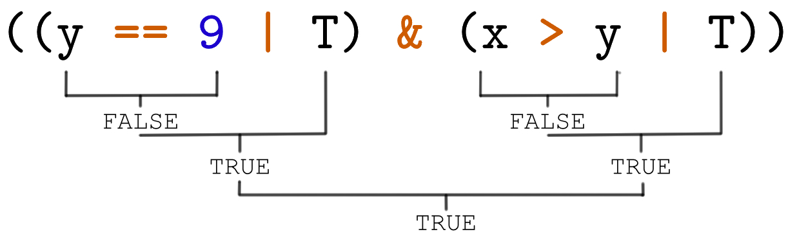

# Introduction to `r fontawesome::fa(name = "r-project", fill = "steelblue")` and RStudio

```{r, echo = FALSE}
set.seed(123)
```


.font150[Outline]

.pc1[

.content-box-grey[

## Part 1
- R and R-Studio
- Basics
- Vectors
- Matrices

]]

.pc2[

.content-box-grey[

]]

.pc3[
.content-box-green[

## Part 2 
- [Logical Statements](#logicals)
- [Dataframes](#dfs)
- [Lists](#lists)
- [If-Statements](#cond)
- [Loops](#loops)
- [Functions](#functions)
- [R Packages](#packages)

]]
 
.pc4[

.content-box-grey[
]]


.pc5[

.content-box-grey[

## Part 3
- Distributions and Random Numbers
- Creating Graphics
- Linear Regression

]]

---

name: logicals

# Logical Statements

</br>

.pull-left[

.content-box-purple[

### Introduction

- You have seen the class `logical` already in the first part of this introduction (`class(T)`)
- Logical statements are essential for writing conditional statements (more on that [later](#cond))
- The result of a logical comparison is a boolean: `TRUE` / `FALSE` or `T ` / `F `

]]
.pull-right[

.content-box-pruple[

.font130[

### Important Operators:
```{}
==  "Exactly equal to"
!=  "Not equal to"
<   "Less than"
<=  "Less than or equal to"
>   "Greater than"
>=  "Greater than or equal to"
&   "And"
|   "Or"
!   "Negate"
```

]]]

---

# Logical Statements

## Logical Evaluation

</br>

.font120[Logical Statements are evaluated from the inside to the outside.]

</br>

```{r, echo = F, out.width = "900px", fig.align='center'}

```

---

# Logical Statements - Examples

```{r }
x <- 5
y <- 10
```

.pull-left[

```{r}
x == y
x > y | y == 10
x > y | x == 10
```

]

.pull-right[

```{r}
!(x == y | y < x)
((y == 9 | T) & (x > y | T))
!T & !F
```

]

---

# Logical Statements - Exercises

.pull-left[

1) Decide for each of the following statements if it's `TRUE` or `FALSE`?

```{}
5 > 5
```

```{}
T == 5
```

```{}
T & F | F & T
```


```{}
F & F & F | T
```

```{}
(!(5 > 3) | "A" == "B")
```

```{}
!(((T > F) > T) & !T)
```


]

.pc2[

.content-box-grey[

]]

.pull-left[

2) Given `z <- c(1,2,NA,4)`. What will be the result of the following statements?

```{}
is.na(z)
```

```{}
!is.numeric(z[2])
```

```{}
!(min(z) != max(z))
```

```{}
length(z) != 2
```


```{}
length(z == 2)
```

```{}
is.numeric(z)
```

]

---

# Logical Statements - Exercises

.pull-left[

3.) Given `M <- matrix(1:9, ncol = 3)` are the following statements TRUE or FALSE? 

```{}
M == 5
```

```{}
sum(M[,1]) == 6
```

```{}
max(M[,2]) <= 5
```

```{}
M[2,2] != 4 & M[2, 2] > 6
```

```{}
colSums(M) == 15
```

```{}
sum(diag(M)) == 15
```

]

---

name: dfs

# Dataframes

## About Dataframes

A dataframe is a collection of variables. Dataframes feature similarities to matrices and lists.

Let's take a look at the first 10 rows of the `iris` dataframe:

```{r, eval = T}
iris[1:10,]
```

---

# Dataframes

.pull-left[

## About Dataframes

- `str()` gives an overview about the structure of an object
- Iris:
  - The class is 'data.frame'
  - Contains 5 Variables (Columns) with 150 observations (Rows)
  - The class of the 'Species' is 'Factor' 
  - The other 4 variables are 'numeric'

]

.pull-right[

.content-box-purple[

## Example

```{r, eval = T}
str(iris)
```

This dataset is part of the [datasets](https://www.rdocumentation.org/packages/datasets/versions/3.6.1) package which is part of Base R. Type `library(help = "datasets")` to get a full list of datasets.

]]

---

# Dataframes

.pull-left[

## Create Dataframes

- Use `data.frame()` to create a dataframe
- `data.frame()` takes vectors as arguments
- All vectors must have the same length
- In contrast to matrices, those vectors can be of different classes
- Vectors can be named (optional)
- Note that we are using the vector `z` from Exercise 2. Since we didn't name it, R calls it 'z'

]

.pull-right[

## Example

```{r, echo = FALSE}
z <- c(1,2,NA,4)
```


```{r}
df <- data.frame(
  Letters = c("A", "B", "C", "D"), 
  Numbers = 1:4,
  Logicals = c(T,F,FALSE,TRUE),
  z)
df
```

]
---

# Dataframes

.pull-left[

## Subsetting

- Subsetting dataframes is similar to subsetting matrices 'df[rows,cols]'
- Additonally: you can access variables (columns) with the '$' sign. 
- Also: obtain named columns by 'df[ , 'colname']'
  - This is especially useful when the position of the column changes
- You can also use logical statements to subset dataframes.

]

.pull-right[

## Examples

```{}
df[, 1]      # Column 1
df[1, ]      # Row 1
df[1, 1]     # Row 1, Column 1
df[, 1:5]    # Columns 1 to 5

df$Numbers   # Column 'Numbers'
df[, c('Numbers', # Columns 'Numbers'
       'Lettes')] # and 'Letters'

# Rows where 'Letters' equals 'B'
df[df$Letters == "B", ]

# Rows where 'Numbers' greater 2
df[df$Numbers > 2, ]
```


]

---

# Dataframes

.pull-left[

## Manipulation

- You can modify dataframes in various ways:
  - Add or Remove Variables or Observations
  - Edit single Observations
  - Rename rows and columns

]

.pull-right[

## Examples

```{r, eval = T}
# Rename Rows
row.names(df) <- c("1st", "2nd", "3rd", "4th")
# Add column 'Greeks'
df$Greeks <- c("alpha", "beta", "gamma", "delta")
# Remove second row
df        <- df[-2, ]
# Set observation to NA
df[2, 2]  <- NA
df
```

]

---

# Dataframes - Exercises

.pull-left[

4) Get an overview about the `mtcars` dataset. It's already loaded in R.
  - How many observations and variables are present?
  - Obtain the class of each variable.
  - Use the `summary()` function. For help type `?summary` into the console.

5) Subset the `mtcars` dataframe.
  - Only the `mpg` variable.
  - Only the first three rows.
  - Only the first three variables

]

.pull-right[

5) Continued...

  - Only the first 2 observations of the variables `cyl` und `hp`
  - All observations which have `hp` greater than 200. 

6) Create a dataframe `persons` with 3 variables `Name` (`character`), `Height` (`numeric`) and `Weight` (`numeric`) and 5 observations.
  - Obtain the average weight of all persons.
  - Add a variable `Eyecolor`.
  - Combine 2 logical statements to subset the dataframe.

]

---

name: lists

# Lists

.pull-left[

## Overview

- You can create a list with `list()`
- In contrast to data.frames:
  - Elements of a list can be different in dimension and type
  - Lists can even contain lists.
- Hence you can think of a dataframe as special case: a list which exclusively contains vectors of the same length.
- Many functions output their results as a list.
- You can access elemnents of a list with '$'.

]


.pull-right[

## Examples

```{}
my.list <- list(A = 1:5, 
                B = mtcars, 
                C = list(letters, LETTERS))

my.list$A # Access element A

# Simple linear regression
model <- lm(mpg ~ hp, data = mtcars)
model$coefficients # Obtain coefficients
model$residuals    # Obtain residuals

```

Part 3 will cover lists in more detail.

]

---

name: cond

# The If Statement

If statements allow you to specify logical conditions which need to hold for code to be executed. The simples conditional statement is called 'if' statement.

```{r}
if (x == 5) print("Hello World!")
```

You can read if statements like a natural sentencce: If x equals 5 print 'Hello World!'. Note that we assigned 5 to x in the logicals example. That caused the code to run.

The condition inside the if statement must always evaluate to `TRUE` or `FALSE`. Only if the statement evaluates to true, the code gets executed.

Code with more than 1 single line, can be wrapped in curly brackets:
```{r, eval = F}
if (x == 5) {
  # Code
  # ...
}
```

---

# The If Statement

## Examples

```{r}
# If the class of x is 'numeric' Print 'x is a number!'
if ( class(x) == "numeric" ) print("x is a number!")

# If 2*x equals y print 'Double x to get y!'
if (2 * x == y) print("Double x to get y!")

# If the length of z is at least 2 AND `op` equals 'add': sum up all elements of z.
z  <- 1:10
op <- "add"
if (length(z) > 1 & op == "add") {
  sum(z)
}
```

---

# The If Statement

## If-Else Statements

</br>

Sometimes you need to write code for both cases: the condition is `TRUE` or the conditiona is `FALSE`.

The solution is the if-else statement:

</br>

.font120[
```{}
if (expr) {    # If 'expr' is TRUE ...
  # BLOCK 1    # execute 'BLOCK 1' ...
} else {       # else ...
  # BLOCK 2    # execute 'BLOCK 2'
}
```
]

---

# The If Statement

## If-Else Statements - Examples

```{r}
if (is.numeric(x) & x >= 0) {
  x^(-0.5)
} else {
  print("x is not a number or its negative!")
}

if(length(x) > 1 & op == "add") {
  sum(x)
} else if(length(x) > 1 & op == "mult") {
  prod(x)
} else {
  print("x is not a vector!")
}
```


---

# The If Statement

## If-Else Statements

</br>

As you might have seen: you can combine any number of `if` and `else` statements:

.font120[
```{}
if (expression) {
  # ...
} else if(expression) {
  # ...  
} else if(expression) {
  # ...  
} else {
  # ...  
}
```
]

---

# The If Statement - Exercises

</br>

7) Create a snippet which outputs the squareroot of a numeric 'x' which has a length of 1 and is non negative.

</br>

8) Write a snippet, which calculates the squareroot of each element of a vector `x` if all ements in `x` are positive.

  <details>
    <summary>Hint</summary>
    Think about using a function like 'min()' or 'sum()'.
  </details>

</br>

9) Write a snippet which outputs the structure of `df` if `df` belong to the class `data.frame`. Otherwise the length of the object should be returned. 

</br>

.center[**Validate your code by trying different inputs.**]

---

name: loops

# Loops

## The `for` loop

The `for` loop has the following structure:
```{r, eval = F}
for(var in enumeration) {
  # Code
}
```

The `Code` is executed for every element in `enumeration` and in every iteration `var` is defined as one of the values in `enumeration`. Lets look at an example: 


```{r, eval=T}
for(chr in LETTERS) { # chr represents the first element of LETTERS in the first iteration
  cat(chr, " ")       # Hence A get's printed in the first run, B in the second etc.
}                     # The loop runs until the last value of LETTERS was assigned to chr
```

---

# Loops

## The `while` loop

.pull-left[

## Overview:

The `while()` loop is usefull if the number of iterations is not known beforehand.

A `while()` loop has the following stucture:
```{r, eval = F}
while(condition) {
  # Code
}
```

As long as `condition` evaluates to TRUE the `Code` is executed again. 

]

.pull-right[

## Example:

This loop draws a and prints random numbers from a uniform distribution as long as the last drawn number is less than 4.

```{r}
x <- 0
while(x < 4) {
  x <- runif(n = 1, min = 1, max = 5)
  cat(x, " ", "\n")
}
```
]

---

# Loops - Exercises

10) Write a loop which sums up alls numbers from 1 to 15. (You really don't need a loop for that. Do it nonetheless!)

</br>

11) Create the following Matrix and assign it to $M$:
$$
\begin{pmatrix}
1 & 4 & 7 & 10 & 13\\
2 & 5 & 8 & 11 & 14\\
3 & 6 & 9 & 12 & 15\\
\end{pmatrix}
$$
Write a loop which calculates the sum of each column and prints it to the console.

</br>

12) We can draw one random number from the standard normal distribution with `rnorm(1)` (Try this in the console!). Write a loop which draws random numbers as long as the drawn number is less or equal to 1. Output the number of each iteration with `cat(x, "\n")` (Hint: `\n` creates a linebreak).

---

name: functions

# Functions

## Define a function

.pull-left[

## Overview

- You use many functions already: `length()`, `sum()`, `min()`, `data.frame()`, ...

- Sometimes it is useful to define your own function. You can do this like that:

```{r, eval = F}
name.of.fnctn <- function(arg1,...) {
  # Function Body
  return(obj)
}
```

]

.pull-right[

## Example

Let's define a function `summy()` which takes two arguments `y` and `x` and adds them together. 

```{r, eval = T}
# Define summy()
summy <- function(x, y) {
  return(x + y)
} 

# Use summy()
summy(x = 1, y = 3)
```


]

---

# Functions

## Default values for arguments

Sometimes it's a good idea to specify default values for arguments. The function `rnorm()` for example has `0` and `1` as default values for `mean` and `sd` respecitvely.

In consequence, a call of `rnorm(1)` will draw a number from the **standard** normal distribution. 

You can specify default values as follows:

.font120[

```{r}
summy <- function(x = 1, y = 4) {
  return(x + y)
} 

summy() # Now y and x take the values 1 and 4 if not specified otherwise.
```
]
---

# Functions

## Scoping

Note: all objects that are specified in the body of a function are only accessible inside that function. One has to `return()` those values, otherwise the function doesn't produce any output:

.font110[

```{r}
internal.ops <- function() {
  int.x <- 5    # You can't use int.x outside of internal.ops()
} 

internal.ops()  # int.x won't be saved into your working environment
```


```{r}
internal.ops <- function() {
  int.x <- 5
  return(int.x) # This enshures that internal.ops() returns the value of x.int
} 

internal.ops()  # int.x won't be saved into your working environment
```

]

---

# Functions - Exercises

13) Recall that the density of the standard normal distribution is defined as follows: 

$$
\frac{1}{\sqrt{2\pi}} e^{-\frac{x^2}{2}}
$$ 

Write a function `stdn_d`, which calculates the density of `x`. Don't forget to `return()` the result.

<details>
    <summary>Hint</summary>
    Those commands might be useful: '?exp' '?pi'
</details>

**Note:** If your function is correctly specified, `stdn_d(x)` and `dnorm(x)` will produce the same result.

</br>

14) Write a function `calc()` which takes two arguments: `z` and `opt`. If `opt` equals `add` your function should add all elements of `z`. If `opt` equals `mult` your function should multiply all elements of `z`. Otherwise your function should `print()` a message 'Please specify 'opt' as 'add' or 'mult''

Don't forget to `return()` the results.

---

# Functions - Exercises

15) Write a function that computes the MSE (mean squared error) of the two vectors `y` and `yhat`. The MSE is defined as: 

$$
\frac{1}{n}\sum_{i=1}^n (\hat{Y}_i - Y_i)^2
$$

Testen your function with the following two vectors: $y = {2, 4, 2, 5, 7}$ und $\hat{y}= {2.3, 3.5, 2.1, 5.5, 7.6}$ (The result should be 0.192).

</br>

16) (Advanced) The Fibonacci sequence starts with ${1, 1, 2, 3, 5, 8, 13, ...}$. It begins with $1,1$, all other values represent the sum of the two preceeding numbers.
Write a function `fibonacci(x)`, which takes a single argument $x$. This argument represents the position of the number of the fibonacci sequence which should be returned.

**Hint:** You can call functions recursively. So you can call `fibonacci()` inside itself.

---

name: packages

# R Packages

## Overview

</br>

The extensibility of R is one of it's main strength.

</br>

Everyone can develop packages for R and provide them to other users.

</br>

[CRAN](https://cran.r-project.org/) (Comprehensive R Archive Network) is a distributed archive for R packages.

</br>

If you are interested in developing your own package, take a look at [R Packages](http://r-pkgs.had.co.nz/) from Hadley Wickham.

---

# R Packages

## Install, Update and Remove Packages

</br>

A very important repository is the CRAN Server of RStudio. This is also the default repository.

```{r}
options(repos = c(CRAN = "https://cran.rstudio.com"))  # Standard
```

Other CRAN Servers
- https://cloud.r-project.org/
- https://cran.uni-muenster.de/

Those servers contain the latest stable releases of most R packages (currently `r nrow(available.packages())`). 

Packages have to meet some requirements in order to get published on CRAN.

---

# R Packages

## Install, Update and Remove Packages

</br>

The user interface of RStudio provides everything you need to manage your packages.

However, you can manage your packages 'by hand' with the following functions:  `install.packages()`, `update.packages()` und `remove.packages()`.

.font130[
```{}
install.packages("dplyr")       # check out dplyr to improve your skills :)
update.packages("dplyr")
remove.packages(pkgs = "dplyr") # You would regret that!
```
]
---

# Packages

## Beyond CRAN

Developement versions can usually be found on [GitHub](http://www.github.com) or [BitBucket](http://www.bitbucket.com)

The package [pak](https://github.com/r-lib/pak) allows to install packages from Github etc. without any effort

Install [emoGG](https://github.com/dill/emoGG) from github:

.font130[

```{}
# With pak
install.packages("pak")
pak::pkg_install("dill/emoGG")

# Alternatively with remotes
install.packages("remotes")
remotes::install_github("dill/emoGG")
```

]

---

# Digression

- Look around `r fontawesome::fa("eye")`
- Search on stackoverflow `r fontawesome::fa("stack-overflow")`
- Be curious `r fontawesome::fa("smile-beam")`

The possibilities with R and RStudio are nearly endless. Here is a simple example using the 'ggplot2' and 'emoGG' package:

```{}
library(ggplot2)
library(emoGG)
avocado <- read.csv("assets/avocado.csv")
ggplot(avocado, aes(Jahr, imp_tons_usa)) +
  emoGG::geom_emoji(emoji="1f951") +
  labs(title = "Importmenge von Avocados in die USA von 2010 bis 2018") +
  ylab("Importmenge (Tonnen)")
```

---

# Digression

## ggplot2 + emogg 

```{r, eval=T, echo=FALSE, fig.retina = 10, fig.width=12, fig.height=6, fig.align='center'}
library(ggplot2)
avocado <- read.csv("assets/avocado.csv")
ggplot(avocado, aes(Year, imp_tons_usa)) +
  emoGG::geom_emoji(emoji="1f951") +
  labs(title = "Import of Avocado USA from 2010 to 2018") +
  ylab("Import (Tons)")
```

---
# Digression

## More sophisticated plots

<div style="position:relative; margin-top:-100px; z-index: 0">

```{r, echo=FALSE, message=FALSE}
load("assets/rf.plot.rda")

f <- paste0("p.rf.html")
htmlwidgets::saveWidget(rf_plot, f)
htmltools::tags$iframe(
    src=f,
    width="97%", 
    height="600",
    scrolling="no", 
    seamless="seamless", 
    frameBorder="0"
  )

```
</div>

---

# Digression

## Advanced R

If youre curious whats possible using R and RStudio consider taking the course 'Advanced R'. It's focused on programming rather than Econometrics. The following topics will be covered:

- Version Control with Git and Github
- Creating Web Apps with Shiny
- Webscraping
- Functional Programming
- Creating plots with ggplot2
- Writing Reports with Rmarkdown
- Using Rcpp
- Using Datatable

---

class: center, middle, sydney-blue

Thank you for participating!

</br>

`r fontawesome::fa("laptop-code", height = 50, fill = "#f2f2f2")`


<a href="https://github.com/BerriJ" class="github-corner" aria-label="View source on Github"><svg width="80" height="80" viewBox="0 0 250 250" style="fill:#f2f2f2; color:#212121; position: absolute; top: 0; border: 0; right: 0;" aria-hidden="true"><path d="M0,0 L115,115 L130,115 L142,142 L250,250 L250,0 Z"></path><path d="M128.3,109.0 C113.8,99.7 119.0,89.6 119.0,89.6 C122.0,82.7 120.5,78.6 120.5,78.6 C119.2,72.0 123.4,76.3 123.4,76.3 C127.3,80.9 125.5,87.3 125.5,87.3 C122.9,97.6 130.6,101.9 134.4,103.2" fill="currentColor" style="transform-origin: 130px 106px;" class="octo-arm"></path><path d="M115.0,115.0 C114.9,115.1 118.7,116.5 119.8,115.4 L133.7,101.6 C136.9,99.2 139.9,98.4 142.2,98.6 C133.8,88.0 127.5,74.4 143.8,58.0 C148.5,53.4 154.0,51.2 159.7,51.0 C160.3,49.4 163.2,43.6 171.4,40.1 C171.4,40.1 176.1,42.5 178.8,56.2 C183.1,58.6 187.2,61.8 190.9,65.4 C194.5,69.0 197.7,73.2 200.1,77.6 C213.8,80.2 216.3,84.9 216.3,84.9 C212.7,93.1 206.9,96.0 205.4,96.6 C205.1,102.4 203.0,107.8 198.3,112.5 C181.9,128.9 168.3,122.5 157.7,114.1 C157.9,116.9 156.7,120.9 152.7,124.9 L141.0,136.5 C139.8,137.7 141.6,141.9 141.8,141.8 Z" fill="currentColor" class="octo-body"></path></svg></a><style>.github-corner:hover .octo-arm{animation:octocat-wave 560ms ease-in-out}@keyframes octocat-wave{0%,100%{transform:rotate(0)}20%,60%{transform:rotate(-25deg)}40%,80%{transform:rotate(10deg)}}@media (max-width:500px){.github-corner:hover .octo-arm{animation:none}.github-corner .octo-arm{animation:octocat-wave 560ms ease-in-out}}</style>