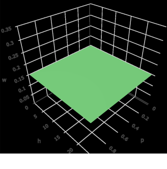
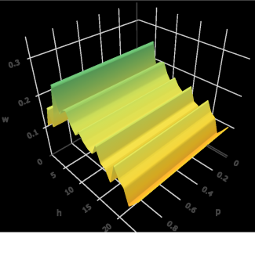
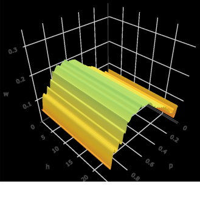
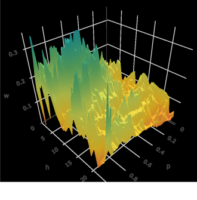
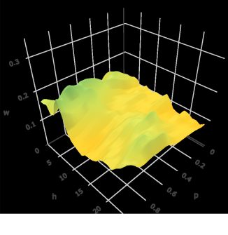
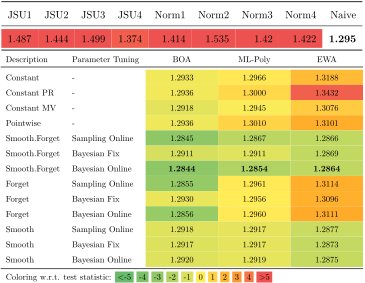

```{r, setup, include=FALSE}
# Compile with: rmarkdown::render("crps_learning.Rmd")

# remotes::install_github("berrij/profoc@0.9.3")

library(latex2exp)
library(ggplot2)
library(dplyr)
library(tidyr)
library(purrr)
library(kableExtra)
library(gt)
library(plotly)
knitr::opts_chunk$set(
  dev = "svglite" # Use svg figures
)
library(RefManageR)
BibOptions(
  check.entries = TRUE,
  bib.style = "authoryear",
  cite.style = "authoryear",
  style = "html",
  hyperlink = "to.doc",
  dashed = FALSE
)
my_bib <- ReadBib("assets/library.bib", check = FALSE)
col_lightgray <- "#e7e7e7"
col_blue <- "#000088"
col_smooth_expost <- "#a7008b"
col_smooth <- "#187a00"
col_pointwise <- "#008790"
col_constant <- "#dd9002"
col_optimum <- "#666666"

# https://www.schemecolor.com/sweeping-fall.php
col_green <- "#61B94C"
col_orange <- "#ffa600"
col_yellow <- "#FCE135"
```

```{r xaringan-panelset, echo=FALSE}
xaringanExtra::use_panelset()
```

```{r xaringanExtra-freezeframe, echo=FALSE}
xaringanExtra::use_freezeframe(responsive = TRUE)
```

name: motivation

# Outline

</br>

1. Multivariate CRPS Learning
  - Introduction
  - Smoothing procedures
  - Application to multivariate electricity price forecasts
2. The `profoc` R package
  - Package overview
  - Implementation details
  - Illustrative examples

---

# Introduction to Multivariate CRPS Learning

.pull-left[

The Idea:
- Combine multiple forecasts instead of choosing one

- Combination weights may vary over **time**, over the **distribution**, and over **covariates**

2 Popular options for combining distributions:
- Combining across quantiles (this paper)
  - Horizontal aggregation, vincentization
- Combining across probabilities
  - Vertical aggregation

]

.pull-right[

<div style="position:relative; margin-top:-25px; z-index: 0">

.panelset[
.panel[.panel-name[Time]

```{r, echo = FALSE, fig.height=6, cache = FALSE}
par(mfrow = c(3, 3), mar = c(2, 2, 2, 2))
set.seed(1)
# Data
X <- matrix(ncol = 3, nrow = 15)
X[, 1] <- seq(from = 8, to = 12, length.out = 15) + 0.25 * rnorm(15)
X[, 2] <- 10 + 0.25 * rnorm(15)
X[, 3] <- seq(from = 12, to = 8, length.out = 15) + 0.25 * rnorm(15)
# Weights
w <- matrix(ncol = 3, nrow = 15)
w[, 1] <- sin(0.1 * 1:15)
w[, 2] <- cos(0.1 * 1:15)
w[, 3] <- seq(from = -2, 0.25, length.out = 15)^2
w <- (w / rowSums(w))
# Vis
plot(X[, 1],
  lwd = 4,
  type = "l",
  ylim = c(8, 12),
  xlab = "",
  ylab = "",
  xaxt = "n",
  yaxt = "n",
  bty = "n",
  col = "#2050f0"
)
plot(w[, 1],
  lwd = 4, type = "l",
  ylim = c(0, 1),
  xlab = "",
  ylab = "", xaxt = "n", yaxt = "n", bty = "n", col = "#2050f0"
)
text(6, 0.5, latex2exp::TeX("$w_1(t)$"), cex = 2, col = "#2050f0")
arrows(13, 0.25, 15, 0.0, , lwd = 4, bty = "n")
plot.new()
plot(X[, 2],
  lwd = 4,
  type = "l", ylim = c(8, 12),
  xlab = "", ylab = "", xaxt = "n", yaxt = "n", bty = "n", col = "purple"
)
plot(w[, 2],
  lwd = 4, type = "l",
  ylim = c(0, 1),
  xlab = "",
  ylab = "", xaxt = "n", yaxt = "n", bty = "n", col = "purple"
)
text(6, 0.6, latex2exp::TeX("$w_2(t)$"), cex = 2, col = "purple")
arrows(13, 0.5, 15, 0.5, , lwd = 4, bty = "n")
plot(rowSums(X * w), lwd = 4, type = "l", xlab = "", ylab = "", xaxt = "n", yaxt = "n", bty = "n", col = "#298829")
plot(X[, 3],
  lwd = 4,
  type = "l", ylim = c(8, 12),
  xlab = "", ylab = "", xaxt = "n", yaxt = "n", bty = "n", col = "#e423b4"
)
plot(w[, 3],
  lwd = 4, type = "l",
  ylim = c(0, 1),
  xlab = "",
  ylab = "", xaxt = "n", yaxt = "n", bty = "n", col = "#e423b4"
)
text(6, 0.25, latex2exp::TeX("w_3(t)"), cex = 2, col = "#e423b4")
arrows(13, 0.75, 15, 1, , lwd = 4, bty = "n")
```

]

.panel[.panel-name[Distribution]
```{r, echo = FALSE, fig.height=6, cache = FALSE}
par(mfrow = c(3, 3), mar = c(2, 2, 2, 2))
set.seed(1)
# Data
X <- matrix(ncol = 3, nrow = 31)

X[, 1] <- dchisq(0:30, df = 10)
X[, 2] <- dnorm(0:30, mean = 15, sd = 5)
X[, 3] <- dexp(0:30, 0.2)
# Weights
w <- matrix(ncol = 3, nrow = 31)
w[, 1] <- sin(0.05 * 0:30)
w[, 2] <- cos(0.05 * 0:30)
w[, 3] <- seq(from = -2, 0.25, length.out = 31)^2
w <- (w / rowSums(w))
# Vis
plot(X[, 1],
  lwd = 4,
  type = "l",
  xlab = "",
  ylab = "",
  xaxt = "n",
  yaxt = "n",
  bty = "n",
  col = "#2050f0"
)
plot(X[, 2],
  lwd = 4,
  type = "l",
  xlab = "", ylab = "", xaxt = "n", yaxt = "n", bty = "n", col = "purple"
)
plot(X[, 3],
  lwd = 4,
  type = "l",
  xlab = "", ylab = "", xaxt = "n", yaxt = "n", bty = "n", col = "#e423b4"
)
plot(w[, 1],
  lwd = 4, type = "l",
  ylim = c(0, 1),
  xlab = "",
  ylab = "", xaxt = "n", yaxt = "n", bty = "n", col = "#2050f0"
)
text(12, 0.5, latex2exp::TeX("$w_1(p)$"), cex = 2, col = "#2050f0")
arrows(26, 0.25, 31, 0.0, , lwd = 4, bty = "n")
plot(w[, 2],
  lwd = 4, type = "l",
  ylim = c(0, 1),
  xlab = "",
  ylab = "", xaxt = "n", yaxt = "n", bty = "n", col = "purple"
)
text(15, 0.5, latex2exp::TeX("$w_2(p)$"), cex = 2, col = "purple")
arrows(15, 0.25, 15, 0, , lwd = 4, bty = "n")
plot(w[, 3],
  lwd = 4, type = "l",
  ylim = c(0, 1),
  xlab = "",
  ylab = "", xaxt = "n", yaxt = "n", bty = "n", col = "#e423b4"
)
text(20, 0.5, latex2exp::TeX("$w_3(p)$"), cex = 2, col = "#e423b4")
arrows(5, 0.25, 0, 0, , lwd = 4, bty = "n")
plot.new()
plot(rowSums(X * w), lwd = 4, type = "l", xlab = "", ylab = "", xaxt = "n", yaxt = "n", bty = "n", col = "#298829")
```

.panel[.panel-name[Covariates]

```{r, echo = FALSE, fig.height=6, cache = FALSE}
par(mfrow = c(3, 3), mar = c(2, 2, 2, 2))
set.seed(1)
# Data
X <- matrix(ncol = 3, nrow = 15)
X[, 1] <- seq(from = 8, to = 12, length.out = 15) + 0.25 * rnorm(15)
X[, 2] <- 10 + 0.25 * rnorm(15)
X[, 3] <- seq(from = 8, to = 11, length.out = 15) + 0.25 * rnorm(15)
# Weights
w <- matrix(ncol = 3, nrow = 15)
w[, 1] <- sin(0.1 * 1:15)
w[, 2] <- cos(0.1 * 1:15)
w[, 3] <- seq(from = -2, 0.25, length.out = 15)^2
w <- (w / rowSums(w))
# Vis
plot(X[, 1],
  lwd = 4,
  type = "l",
  ylim = c(8, 12),
  xlab = "",
  ylab = "",
  xaxt = "n",
  yaxt = "n",
  bty = "n",
  col = "#2050f0"
)
plot(w[, 1],
  lwd = 4, type = "l",
  ylim = c(0, 1),
  xlab = "",
  ylab = "", xaxt = "n", yaxt = "n", bty = "n", col = "#2050f0"
)
text(6, 0.5, latex2exp::TeX("$w_1(x)$"), cex = 2, col = "#2050f0")
arrows(13, 0.25, 15, 0.0, , lwd = 4, bty = "n")
plot.new()
plot(X[, 2],
  lwd = 4,
  type = "l", ylim = c(8, 12),
  xlab = "", ylab = "", xaxt = "n", yaxt = "n", bty = "n", col = "purple"
)
plot(w[, 2],
  lwd = 4, type = "l",
  ylim = c(0, 1),
  xlab = "",
  ylab = "", xaxt = "n", yaxt = "n", bty = "n", col = "purple"
)
text(6, 0.6, latex2exp::TeX("$w_2(x)$"), cex = 2, col = "purple")
arrows(13, 0.5, 15, 0.5, , lwd = 4, bty = "n")
plot(rowSums(X * w), lwd = 4, type = "l", xlab = "", ylab = "", xaxt = "n", yaxt = "n", bty = "n", col = "#298829")
plot(X[, 3],
  lwd = 4,
  type = "l", ylim = c(8, 12),
  xlab = "", ylab = "", xaxt = "n", yaxt = "n", bty = "n", col = "#e423b4"
)
plot(w[, 3],
  lwd = 4, type = "l",
  ylim = c(0, 1),
  xlab = "",
  ylab = "", xaxt = "n", yaxt = "n", bty = "n", col = "#e423b4"
)
text(6, 0.25, latex2exp::TeX("w_3(x)"), cex = 2, col = "#e423b4")
arrows(13, 0.75, 15, 1, , lwd = 4, bty = "n")
```

]]
]]

---

name: pred_under_exp_advice

# The Framework of Prediction under Expert Advice

### The sequential framework

.pull-left[

Each day, $t = 1, 2, ... T$
- The **forecaster** receives predictions $\widehat{X}_{t,k}$ from $K$ **experts**
- The **forecaster** assings weights $w_{t,k}$ to each **expert**
- The **forecaster** calculates her prediction:
\begin{equation}
    \widetilde{X}_{t} = \sum_{k=1}^K w_{t,k} \widehat{X}_{t,k}.
    \label{eq_forecast_def}
\end{equation}
- The realization for $t$ is observed
]

.pull-left[

- The experts can be institutions, persons, or models
- The forecasts can be point-forecasts (i.e., mean or median) or full predictive distributions
- We do not need any assumptions concerning the underlying data
- `r Citet(my_bib, "cesa2006prediction")`

]

---

name: regret
  
# The Regret

Weights are updated sequentially according to the past performance of the $K$ experts.

`r fontawesome::fa("arrow-right", fill ="#000000")` A loss function $\ell$ is needed (to compute the **cumulative regret** $R_{t,k}$)

\begin{equation}
    R_{t,k}  = \widetilde{L}_{t} - \widehat{L}_{t,k} =  \sum_{i = 1}^t \ell(\widetilde{X}_{i},Y_i) - \ell(\widehat{X}_{i,k},Y_i)
    \label{eq_regret}
\end{equation}

The cumulative regret:
- Indicates the predictive accuracy of expert $k$ until time $t$.
- Measures how much the forecaster *regrets* not having followed the expert's advice

Popular loss functions for point forecasting `r Citet(my_bib, "gneiting2011making")`:
.pull-left[
- $\ell_2$-loss $\ell_2(x, y) = | x -y|^2$
  - optimal for mean prediction 
]
.pull-right[
- $\ell_1$-loss $\ell_1(x, y) = | x -y|$ 
  - optimal for median predictions 
]

---


name:crps

.pull-left[

# Probabilistic Setting

An appropriate loss:

\begin{align*}
    \text{CRPS}(F, y) & = \int_{\mathbb{R}} {(F(x) - \mathbb{1}\{ x > y \})}^2 dx
    \label{eq_crps}
\end{align*}

It's strictly proper `r Citet(my_bib, "gneiting2007strictly")`.

Using the CRPS, we can calculate time-adaptive weights $w_{t,k}$. However, what if the experts' performance varies in parts of the distribution? 

`r fontawesome::fa("lightbulb", fill = col_yellow)` Utilize this relation:

\begin{align*}
    \text{CRPS}(F, y) = 2 \int_0^{1}  \text{QL}_p(F^{-1}(p), y) \, d p.
    \label{eq_crps_qs}
\end{align*}

... to combine quantiles of the probabilistic forecasts individually using the quantile-loss QL.

]

.pull-right[

# Optimal Convergence

</br>

`r fontawesome::fa("exclamation", fill = col_orange)` exp-concavity of the loss is required for *selection* and *convex aggregation* properties 

`r fontawesome::fa("exclamation", fill = col_orange)` QL is convex, but not exp-concave 

`r fontawesome::fa("arrow-right", fill ="#000000")` The Bernstein Online Aggregation (BOA) lets us weaken the exp-concavity condition.

Convergence rates of BOA are:

`r fontawesome::fa("arrow-right", fill ="#000000")` Almost optimal w.r.t *selection* `r Citet(my_bib, "gaillard2018efficient")`.

`r fontawesome::fa("arrow-right", fill ="#000000")` Almost optimal w.r.t *convex aggregation* `r Citet(my_bib, "wintenberger2017optimal")`.

]

---

# Multivariate CRPS Learning

.pull-left[

Additionally, we extend the **B-Smooth** and **P-Smooth** procedures to the multivariate setting:

- Basis matrices for reducing 
- - the probabilistic dimension from $P$ to $\widetilde P$
- - the multivariate dimension from $D$ to $\widetilde D$


- Hat matrices
- - penalized smoothing across P and D dimensions

We utilize the mean Pinball Score over the entire space for hyperparameter optimization (e.g, $\lambda$)

]

.pull-right[

*Basis Smoothing*

Represent weights as linear combinations of bounded basis functions:

\begin{equation}
  \underbrace{\boldsymbol w_{t,k}}_{D \text{ x } P} = \sum_{j=1}^{\widetilde D} \sum_{l=1}^{\widetilde P} \beta_{t,j,l,k} \varphi^{\text{mv}}_{j} \varphi^{\text{pr}}_{l} = \underbrace{\boldsymbol \varphi^{\text{mv}}}_{D\text{ x }\widetilde D} \boldsymbol \beta_{t,k} \underbrace{{\boldsymbol\varphi^{\text{pr}}}'}_{\widetilde P \text{ x }P} \nonumber
\end{equation}

A popular choice: B-Splines

$\boldsymbol \beta_{t,k}$ is calculated using a reduced regret matrix:

$\underbrace{\boldsymbol r_{t,k}}_{\text{l x m}} = \boldsymbol \varphi^{\text{pr}} \underbrace{\left({\boldsymbol{QL}}_{\mathcal{P}}^{\nabla}(\widetilde{\boldsymbol X}_{t},Y_t)- {\boldsymbol{QL}}_{\mathcal{P}}^{\nabla}(\widehat{\boldsymbol X}_{t},Y_t)\right)}_{\text{PxD}}\boldsymbol \varphi^{\text{mv}}$

`r fontawesome::fa("arrow-right", fill ="#000000")` $\boldsymbol r_{t}$ is transformed from PxK to LxK

If $\widetilde P = P$ it holds that $\boldsymbol \varphi^{pr} = \boldsymbol{I}$  (pointwise)

For $\widetilde P = 1$ we receive constant weights

]

---

# Multivariate CRPS Learning

.pull-left[

#### Penalized smoothing:

Let $\boldsymbol{\psi}^{\text{mv}}=(\psi_1,\ldots, \psi_{D})$ and $\boldsymbol{\psi}^{\text{pr}}=(\psi_1,\ldots, \psi_{P})$ be two sets of bounded basis functions on $(0,1)$:

\begin{equation}
  \boldsymbol w_{t,k} = \boldsymbol{\psi}^{\text{mv}} \boldsymbol{b}_{t,k} {\boldsymbol{\psi}^{pr}}'
\end{equation}

with parameter matix $\boldsymbol b_{t,k}$. The latter is estimated to penalize $L_2$-smoothing which minimizes

\begin{align}
   & \| \boldsymbol{\beta}_{t,d, k}' \boldsymbol{\varphi}^{\text{pr}}  - \boldsymbol b_{t, d, k}' \boldsymbol{\psi}^{\text{pr}}  \|^2_2 + \lambda^{\text{pr}}  \| \mathcal{D}_{q}  (\boldsymbol b_{t, d, k}' \boldsymbol{\psi}^{\text{pr}})  \|^2_2 +                       \nonumber \\
   & \| \boldsymbol{\beta}_{t, p, k}' \boldsymbol{\varphi}^{\text{mv}}  - \boldsymbol b_{t, p, k}' \boldsymbol{\psi}^{\text{mv}}  \|^2_2 + \lambda^{\text{mv}}  \| \mathcal{D}_{q}  (\boldsymbol b_{t, p, k}' \boldsymbol{\psi}^{\text{mv}})  \|^2_2  \nonumber
\end{align}

with differential operator $\mathcal{D}_q$ of order $q$

Computation is easy since we have an analytical solution.

]


.pull-right[

```{r, fig.align="center", echo=FALSE, out.width = "1000px"}

```

</br>

for( t in 1:T ) {

&nbsp; for( d in 1:D ) {

&nbsp; .grey[...]

&nbsp;&nbsp; $\boldsymbol w_{t,k} = \mathcal{H}^{\text{mv}}  \boldsymbol \varphi^{\text{mv}} \beta'_{t,k} \varphi^{\text{pr}} \mathcal{H}^{\text{pr}}$

&nbsp; }  .grey[\#h]

} .grey[\#t]


]

---

name: application

# Application

.pull-left[

#### Data

- Day-Ahead electricity price forecasts from `r Citet(my_bib, "marcjasz2022distributional")`
- Produced using probabilistic neural networks
- 24-dimensional distributional forecasts
- Distribution assumptions: JSU and Normal
- 8 experts (4 JSU, 4 Normal)
- 27th Dec. 2018 to 31st Dec. 2020 (736 days)
- We extract 99 quantiles (percentiles)


]

.pull-right[

#### Setup

Evaluation: Exclude first 182 observations

Extensions: Penalized smoothing | Forgetting 

Tuning strategies:
- Bayesian Fix
  - Sophisticated Baesian Search algorithm
- Online
  - Dynamic based on past performance
- Bayesian Online
  - First Bayesian Fix then Online

Computation Time: ~30 Minutes

]

---

# Special Cases 

.pull-left[


.panelset[
.panel[
  .panel-name[Constant]

```{r, fig.align="center", echo=FALSE, out.width = "400"}

```

]

.panel[
  .panel-name[Constant PR]

```{r, fig.align="center", echo=FALSE, out.width = "400"}

```

]

.panel[
  .panel-name[Constant MV]

```{r, fig.align="center", echo=FALSE, out.width = "400"}

```

]

]

]


.pull-right[

.panelset[

.panel[
  .panel-name[Pointwise]

```{r, fig.align="center", echo=FALSE, out.width = "400"}

```

]

.panel[
  .panel-name[Smooth]

```{r, fig.align="center", echo=FALSE, out.width = "400"}

```

]

]

]

---

# Results

```{r, fig.align="center", echo=FALSE, out.width = "700px"}

```

---

# Results

```{r, warning=FALSE, fig.align="center", echo=FALSE, fig.width=12, fig.height=6}
load("pars_plot.rds")
B <- 182
pars_plot
```

---

# Results: Hour 16:00-17:00

```{r, fig.align="center", echo=FALSE, fig.width=12, fig.height=6}
load("weights_hour.rds")
wplot
```

---

# Results: Mean

```{r, fig.align="center", echo=FALSE, fig.width=12, fig.height=6}
load("weights_prob.rds")
wplot
```

---

# Profoc R Package

.pull-left[

#### Probabilistic Forecast Combination - profoc 

Available on [Github](https://github.com/BerriJ/profoc) and [CRAN](https://CRAN.R-project.org/package=profoc)

Main Function: `online()` for online learning.
- Works with multivariate and/or probabilistic data
- Implements BOA, ML-POLY, EWA (and the gradient versions)
- Implements many extensions like smoothing, forgetting, thresholding, etc.
- Various loss functions are available 
- Various methods (`predict`, `update`, `plot`, etc.)

]

.pull-right[

#### Speed

Large parts of profoc are implemented in C++.

<center>

</center>

We use `Rcpp`, `RcppArmadillo`, and OpenMP.

We use `Rcpp` modules to expose a class to R
- Offers great flexibility for the end-user
- Requires very little knowledge of C++ code
- High-Level interface is easy to use

]

---

# Profoc - B-Spline Basis

.pull-left[

Basis specification `b_smooth_pr` is internally passed to `make_basis_mats()`:

```{r, echo = TRUE, eval = FALSE, cache = FALSE}
mod <- online(
  y = Y,
  experts = experts,
  tau = 1:99 / 100,
  b_smooth_pr = list(
    knots = 9,
    mu = 0.5,
    sigma = 1,
    nonc = 0,
    tailweight = 1,
    deg = 3
  )
)
```

Knots are distributed using the generalized beta distribution.

]

.pull-right[

Exemplary Basis with 9 Knots:

</br>

```{r, echo = FALSE, message=FALSE, fig.width=6, fig.height=4, fig.align='center', cache = FALSE, warning = FALSE}
library(gganimate)
library(dplyr)
library(tidyr)
library(Matrix)

x <- seq(0.01, 0.99, 0.01)

basis <- profoc:::make_basis_mats(x,
  n = 9,
  mu = 0.5,
  sigma = 1,
  nonc = 0,
  tailw = 1,
  deg = 3
)$basis[[1]]

basis %>%
  as.matrix(dimnames(list(1:nrow(basis), 1:ncol(basis)))) %>%
  as_tibble() %>%
  mutate(
    index = x
  ) %>%
  pivot_longer(!all_of(c("index"))) %>%
  ggplot(aes(x = index, y = value, col = name)) +
  geom_line(linewidth = 2) +
  ylim(c(0, 0.9)) +
  theme_minimal() +
  theme(
    plot.margin = unit(c(0.2, 0.2, 0.2, 0.2), "cm"),
    text = element_text(size = 16),
    legend.position = "none"
  ) +
  xlab(NULL) +
  ylab(NULL)
```

]

---

# Profoc - B-Spline Basis

.pull-left[

Basis specification `b_smooth_pr` is internally passed to `make_basis_mats()`:

```{r, echo = TRUE, eval = FALSE, cache = FALSE}
mod <- online(
  y = Y,
  experts = experts,
  tau = 1:99 / 100,
  b_smooth_pr = list(
    knots = 9,
    mu = 0.3, # NEW
    sigma = 1,
    nonc = 0,
    tailweight = 1,
    deg = 3
  )
)
```

Knots are distributed using the generalized beta distribution.

]

.pull-right[

Exemplary Basis with 9 Knots ...

... and `mu` set to `0.3`:

```{r, echo = FALSE, message=FALSE, fig.width=6, fig.height=4, fig.align='center', cache = FALSE, warning = FALSE}
library(gganimate)
library(dplyr)
library(tidyr)
library(Matrix)

x <- seq(0.01, 0.99, 0.01)

basis <- profoc:::make_basis_mats(x,
  n = 9,
  mu = 0.3,
  sigma = 1,
  nonc = 0,
  tailw = 1,
  deg = 3
)$basis[[1]]

basis %>%
  as.matrix(dimnames(list(1:nrow(basis), 1:ncol(basis)))) %>%
  as_tibble() %>%
  mutate(
    index = x
  ) %>%
  pivot_longer(!all_of(c("index"))) %>%
  ggplot(aes(x = index, y = value, col = name)) +
  geom_line(linewidth = 2) +
  ylim(c(0, 0.9)) +
  theme_minimal() +
  theme(
    plot.margin = unit(c(0.2, 0.2, 0.2, 0.2), "cm"),
    text = element_text(size = 16),
    legend.position = "none"
  ) +
  xlab(NULL) +
  ylab(NULL)
```

]

---

# Profoc - B-Spline Basis

.pull-left[

Basis specification `b_smooth_pr` is internally passed to `make_basis_mats()`:

```{r, echo = TRUE, eval = FALSE, cache = FALSE}
mod <- online(
  y = Y,
  experts = experts,
  tau = 1:99 / 100,
  b_smooth_pr = list(
    knots = 9,
    mu = 0.3,
    sigma = 1,
    nonc = 0,
    tailweight = 1,
    deg = 3,
    periodic = TRUE # NEW
  )
)
```

Knots are distributed using the generalized beta distribution.

]

.pull-right[

Exemplary Basis with 9 Knots ...

... and `mu` set to `0.3` and `periodic = TRUE`

```{r, echo = FALSE, message=FALSE, fig.width=6, fig.height=4, fig.align='center', cache = FALSE, warning = FALSE}
library(gganimate)
library(dplyr)
library(tidyr)
library(Matrix)

x <- seq(0, 1, 0.001)


basis <- profoc:::make_basis_mats(x,
  n = 9,
  mu = 0.3,
  sigma = 1,
  nonc = 0,
  tailw = 1,
  deg = 3,
  periodic = TRUE
)$basis[[1]]

basis %>%
  as.matrix(dimnames(list(1:nrow(basis), 1:ncol(basis)))) %>%
  as_tibble() %>%
  mutate(
    index = x
  ) %>%
  pivot_longer(!all_of(c("index"))) %>%
  ggplot(aes(x = index, y = value, col = name)) +
  geom_line(linewidth = 2) +
  ylim(c(0, 0.9)) +
  theme_minimal() +
  theme(
    plot.margin = unit(c(0.2, 0.2, 0.2, 0.2), "cm"),
    text = element_text(size = 16),
    legend.position = "none"
  ) +
  xlab(NULL) +
  ylab(NULL)
```

]

---

name: conclusion

# Wrap-Up

.pull-left[

  The [`r fontawesome::fa("github")` profoc](https://profoc.berrisch.biz/) R Package:

Profoc is a flexible framework for online learning.

- It implements several algorithms
- It implements several loss functions
- It implements several extensions
- Its high- and low-level interfaces offer great flexibility

Profoc is fast.

- The core components are written in C++
- The core components utilize OpenMP for parallelization

]

.pull-left[

Multivariate Extension:

- Code is available now
- [Pre-Print](https://arxiv.org/abs/2303.10019) is available now

Get these slides:

.center[
<center>

</center>
[https://berrisch.biz/slides/23_06_ecmi/](https://berrisch.biz/slides/23_06_ecmi/)
]
]


<a href="https://github.com/BerriJ" class="github-corner" aria-label="View source on Github"><svg width="80" height="80" viewBox="0 0 250 250" style="fill:#f2f2f2; color:#212121; position: absolute; top: 0; border: 0; right: 0;" aria-hidden="true"><path d="M0,0 L115,115 L130,115 L142,142 L250,250 L250,0 Z"></path><path d="M128.3,109.0 C113.8,99.7 119.0,89.6 119.0,89.6 C122.0,82.7 120.5,78.6 120.5,78.6 C119.2,72.0 123.4,76.3 123.4,76.3 C127.3,80.9 125.5,87.3 125.5,87.3 C122.9,97.6 130.6,101.9 134.4,103.2" fill="currentColor" style="transform-origin: 130px 106px;" class="octo-arm"></path><path d="M115.0,115.0 C114.9,115.1 118.7,116.5 119.8,115.4 L133.7,101.6 C136.9,99.2 139.9,98.4 142.2,98.6 C133.8,88.0 127.5,74.4 143.8,58.0 C148.5,53.4 154.0,51.2 159.7,51.0 C160.3,49.4 163.2,43.6 171.4,40.1 C171.4,40.1 176.1,42.5 178.8,56.2 C183.1,58.6 187.2,61.8 190.9,65.4 C194.5,69.0 197.7,73.2 200.1,77.6 C213.8,80.2 216.3,84.9 216.3,84.9 C212.7,93.1 206.9,96.0 205.4,96.6 C205.1,102.4 203.0,107.8 198.3,112.5 C181.9,128.9 168.3,122.5 157.7,114.1 C157.9,116.9 156.7,120.9 152.7,124.9 L141.0,136.5 C139.8,137.7 141.6,141.9 141.8,141.8 Z" fill="currentColor" class="octo-body"></path></svg></a><style>.github-corner:hover .octo-arm{animation:octocat-wave 560ms ease-in-out}@keyframes octocat-wave{0%,100%{transform:rotate(0)}20%,60%{transform:rotate(-25deg)}40%,80%{transform:rotate(10deg)}}@media (max-width:500px){.github-corner:hover .octo-arm{animation:none}.github-corner .octo-arm{animation:octocat-wave 560ms ease-in-out}}</style>
