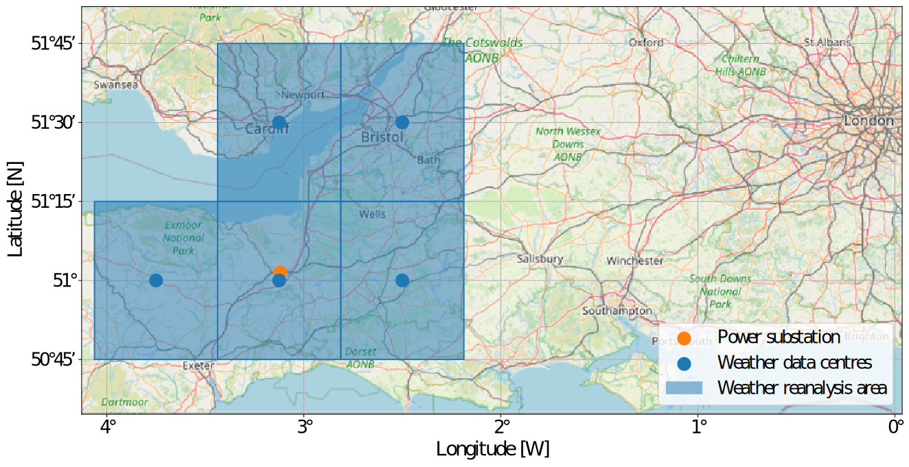
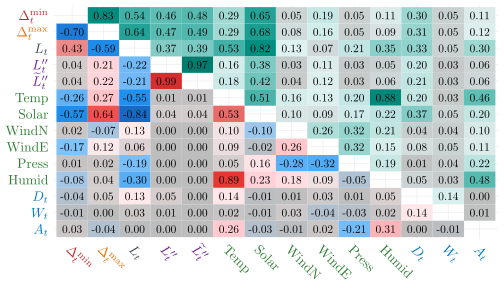
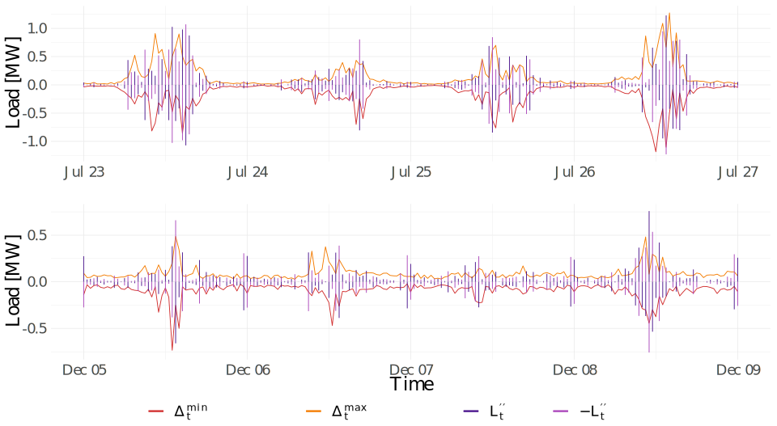
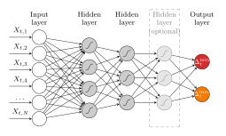
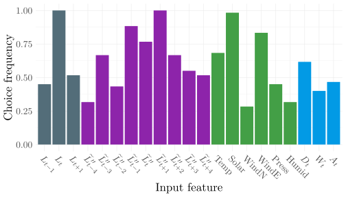

```{r, setup, include=FALSE}
# Compile with: rmarkdown::render("crps_learning.Rmd")
library(latex2exp)
library(ggplot2)
library(dplyr)
library(tidyr)
library(purrr)
library(kableExtra)
library(gt)
library(plotly)
library(data.table)

knitr::opts_chunk$set(
  dev = "svglite", # Use svg figures
  warning = FALSE,
  message = FALSE
)
library(RefManageR)
BibOptions(
  check.entries = TRUE,
  bib.style = "authoryear",
  cite.style = "authoryear",
  style = "html",
  hyperlink = "to.doc",
  dashed = FALSE
)
my_bib <- ReadBib("assets/library.bib", check = FALSE)
col_lightgray <- "#e7e7e7"
col_blue <- "#000088"
col_smooth_expost <- "#a7008b"
col_smooth <- "#187a00"
col_pointwise <- "#008790"
col_constant <- "#dd9002"
col_optimum <- "#666666"

# https://www.schemecolor.com/sweeping-fall.php
col_green <- "#61B94C"
col_orange <- "#ffa600"
col_yellow <- "#FCE135"
```

```{r xaringan-panelset, echo=FALSE}
xaringanExtra::use_panelset()
```

```{r xaringanExtra-freezeframe, echo=FALSE}
xaringanExtra::use_freezeframe(responsive = TRUE)
```


name: motivation

# Motivation

.bold[High Resolution Peak Demand Estimation Challenge]

- Organized by Western Power Distribution and Catapult Energy Systems
- Does limited high-resolution monitoring help estimate future high-resolution peak loads? 

The Objective:
- Estimate minimum and maximum electricity load values (one-minute resolution)
- Given data with only a 30-minute resolution
- One single substation, every half-hour of September 2021

Data:
- From Nov. 2019 to Sept. 2021 (30-minute resolution)
- MERRA-2 weather reanalysis data from five locations close to the substation

---

# Motivation

### Location Overview

```{r, fig.align = "center", out.width = "1000px", echo=FALSE}

```

---
  
# Motivation

### Data Overview

```{r, echo=FALSE, fig.width = 12, fig.height = 5, fig.align="center"}
load("fig/overview.rds")
plot_overview
```

---

# Data

.pull-left[

Targets: $\Delta^{\min}_t$ and $\Delta^{\max}_t$

Possible explanatory variables:

The *half-hourly* load: $L_t$

Discrete second order central difference (DSOCD):

$L_t'' = L_{t-1}-2L_t+L_{t+1}$ 

Deterministic components (to capture potential seasonal characteristics)
- Daily $D_t$ number of hours in a day
- Weekly $W_t$ number of hours in a week
- Annual  $A_t$ number of hours in a meteorological year with $365.24$ days
]

.pull-right[

Weather Inputs: Temperature, Windspeed (North / East), Solar, Humidity

The Figure (next slide) shows how these variables correlate.
- Lower triangle:
  - Pearson's correlation
- Upper triangle:
  - Distance correlation

Distance correlation: non-linear dependency measure that takes values in $[0, 1]$ and characterizes stochastic independence `r Citet(my_bib, "szekely2007measuring")`.

]

---


# Correlation

```{r, fig.align="center", echo=FALSE, out.width = "1000px"}

```

---

# Data

```{r, fig.align="center", echo=FALSE, out.width = "1000px"}

```


---

# Feature Set and Models

.pull-left[

</br>

Selected features based on preliminary analysis:

</br>

| Variable type  | Included feature  | Number  |
|---|---|---|
| Lagged load  | $L_{t-1}$, $L_t$, $L_{t+1}$  |  3 |
| Lagged DSOCD load  |  $\widetilde{L}_{t-4}'',\ldots , \widetilde{L}_{t+4}''$ | 9  |
| Weather inputs  | Temp, Solar, WindN, WindE, Press, Humid  | 6  |
| Seasonal inputs  |  $D_t$, $W_t$, $A_t$ | 3  |

]

.pull-right[

</br>

Considered Models:

- Generalized Additive Model (GAM)
- Multilayer Perceptron Network (MLP)
- Combinations of the above

Competition Benchmark:

.bold[Naive]

$$L_t^{\max} = L_t$$
$$L_t^{\min} = L_t$$

]

---

# Modelling Approach: GAM

### Generalized Additive Model (GAM)

.pull-left[

\begin{equation}
	\Delta^{m}_t = \sum_{i=1}^L f_i( X_{t,1}, \ldots, X_{t,N}) + \epsilon_t
	\label{eq_GAM_gen}
\end{equation}
where $m\in\{\min , \max\}$

Traditional framework using cubic B-splines

*GAM.full* Specification (with all 2-way interactions):

\begin{align}
	\Delta^{m}_t =& \sum_{i=1}^N b_{k_0}( X_{t,i} ) + \nonumber \\
  &\sum_{i=1}^N \sum_{j=1,j>i}^N b_{k_1,k_2}( X_{t,i}, X_{t,j} ) +\epsilon_t
	\label{eq_big_GAM}
\end{align}

]

.pull-right[

$b_{k_0}$ and $b_{k_1,k_2}$ denote univariate and bivariate splines with $k_0$, and $(k_1,k_2)$ knots.
Tensor interaction splines -> only capture the joint effects.

We set $k_0=27$ and $k_1=k_2=9$. Thus, linear terms are specified by $27$ parameters and bivariate terms by $81$ parameters.

*GAM.red*:

Interactions with $L_t$, $\widetilde{L}_t''$ and $\text{Solar}_t$.

*GAM.simple*:
\begin{align}
	\Delta^{m}_t =  b_{k_0}( L_t ) +  b_{k_0}( \widetilde{L}_t'') + b_{k_0}( \text{Solar}_t )
	+\epsilon
	\label{eq_simple_GAM}
\end{align}


]

---

# Modelling Approach: MLP

.pull-left[

Multilayer Perceptron Network:
```{r, fig.align="center", echo=FALSE, out.width = "500px"}

```

Hyperparameters are tuned using OPTUNA Python package `r Citet(my_bib, "akiba2019optuna")`

]

.pull-right[
- Input feature selection
- Number of hidden layers -- either 2 or 3
- Dropout layer -- whether to use it after the input layer and, if yes, at what rate.
- Activation functions in the hidden layers: elu, relu, sigmoid, softmax, softplus, and tanh
- Number of neurons in the hidden layer drawn on an exp-scale from $[4,128]$
- $L_1$ regularization -- whether to use it on the hidden layers and, if yes, at what rate.
- Learning rate for the Adam optimization algorithm drawn on an exp-scale from $\left(10^{-5}, 10^{-1}\right)$ interval
]

---

# GAM Parameter Significance

</br>

.pull-left[

|		Min                             | EDF                         | F    | Max                             | EDF  | F    |
| --- |
|		$L_t$                                    | 9.5                         | 8.9  | $L_t$                                    | 10.8 | 17.6 |
|		$\widetilde{L}_{t-1}''$                     | 8.8                         | 4.4  | $\widetilde{L}_{t-2}''$                     | 6.7  | 4.9  |
|		$\widetilde{L}_{t+1}''$                     | 8.4                         | 4.8  | $L_{t-1}$                                | 6.3  | 6.9  |
|		$\widetilde{L}_{t}''$                       | 8.2                         | 4.6  | $L_{t+1}$                                | 5.4  | 5.0  |
|		Humid                                    | 6.1                         | 3.7  | $D_t$                                    | 4.8  | 3.1  |
|		WindE                                    | 5.1                         | 8.9  | Temp                                     | 4.1  | 11.5 |
|		$A_t$                                    | 4.7                         | 4.9  | Solar                                    | 4.0  | 5.5  |
|		WindN                                    | 4.2                         | 8.5  | WindE                                    | 3.8  | 5.8  |
|		Temp                                     | 3.5                         | 3.6  | $\widetilde{L}_{t+4}''$                     | 3.2  | 2.1  |
|		$L_{t-1}$                                | 3.3                         | 1.3  | $\widetilde{L}_{t+1}''$                     | 3.1  | 2.2  |

]

.pull-right[
  


|		Min                             | EDF                         | F    | Max                             | EDF  | F    |
| --- |
|		$L_t$, $A_t$                             | 26.7                        | 7.8  | $L_t$, $A_t$                             | 37.8 | 28.1 |
|		$L_t$, Solar                             | 20.7                        | 11.2 | $L_t$, $D_t$                             | 25.1 | 20.6 |
|		$L_t$, $D_t$                             | 18.3                        | 8.2  | Solar, $A_t$                             | 15.4 | 6.4  |
|		$L_t$, $L_{t+1}$                         | 17.1                        | 4.0  | $\widetilde{L}_{t}''$, $\widetilde{L}_{t-1}''$ | 14.9 | 6.5  |
|		$\widetilde{L}_{t}''$, $\widetilde{L}_{t-1}''$ | 13.5                        | 2.5  | Solar, $D_t$                             | 11.0 | 8.5  |
|		$L_t$, Temp                              | 13.3                        | 3.1  | $\widetilde{L}_{t}''$, $\widetilde{L}_{t+1}''$ | 11.0 | 2.4  |
|		$L_t$, $L_{t-1}$                         | 13.0                        | 4.9  | $\widetilde{L}_{t}''$, $\widetilde{L}_{t+2}''$ | 10.7 | 2.8  |
|		$\widetilde{L}_{t}''$, $\widetilde{L}_{t+1}''$ | 12.1                        | 2.3  | $L_t$, Solar                             | 10.0 | 2.9  |
|		$L_t$, $W_t$                             | 11.7                        | 3.0  | $\widetilde{L}_{t}''$, Temp                 | 9.5  | 3.4  |
|		$\widetilde{L}_{t}''$, $\widetilde{L}_{t+2}''$ | 11.4                        | 2.9  | $L_t$, WindE                             | 9.3  | 2.5  |

]

---

# MLP Feature Importance

```{r, fig.align="center", echo=FALSE, out.width = "1000px"}

```

---

# Study Design and Evaluation

</br>

.pull-left[

Rolling Window Forecasting Study:
- Length: 12 Months (10/2020 - 09/2021)
- 1-Month shifts
- Evaluation by RMSE

Competition Design:
- Only evaluating 09/2021
- Rank base on Score (relative RMSE)

\begin{align}
	\text{Score} & = \text{RMSE}(\text{Model}) / \text{RMSE}(\textbf{naive}).
\end{align}

]

.pull-right[

Considered Models:

- .bold[GAM.full]
- .bold[GAM.red]
- .bold[DNN]
- .bold[naive]
- .bold[Combination of GAM.full, GAM.red, and DNN]

Two additional GAM models for diagnostic purposes:

- .bold[GAM.simple]
- .bold[GAM.no.Weather]


]

---

# Results 

</br>
</br>

```{r, echo = FALSE}
load("fig/table_overall.Rdata")
tab %>%
  tab_options(
    data_row.padding = px(4),
    # column_labels.border.bottom.color = "#8d8d8d",
    # table_body.border.bottom.color = "#8d8d8d"
  )
```

---

name: wrap

# Wrap-Up

.pull-left[

Estimating high-resolution elecricity peak demand using lower-resolution data:

- .bold[GAM.full] and .bold[GAM.red] perform similar
- .bold[DNN] beats .bold[GAM.full] in some Months
- .bold[Combination of GAM.full, GAM.red, and DNN] performs best

- Weather variables improve the skill score by 1.5 percentage points on average
- .bold[DNN] performs better at predicting maximum peak loads

`r fontawesome::fa("newspaper")` `r Citet(my_bib, "berrisch2023high")`

]

.pull-right[

We won the competition.

- 42.6% vs. 43.6% (second place)
- Using slightly different model

.center[
<center>

</center>
[berrisch.biz/slides/23_09_inrec](https://berrisch.biz/slides/23_09_inrec/)
]

]


<a href="https://github.com/BerriJ" class="github-corner" aria-label="View source on Github"><svg width="80" height="80" viewBox="0 0 250 250" style="fill:#f2f2f2; color:#212121; position: absolute; top: 0; border: 0; right: 0;" aria-hidden="true"><path d="M0,0 L115,115 L130,115 L142,142 L250,250 L250,0 Z"></path><path d="M128.3,109.0 C113.8,99.7 119.0,89.6 119.0,89.6 C122.0,82.7 120.5,78.6 120.5,78.6 C119.2,72.0 123.4,76.3 123.4,76.3 C127.3,80.9 125.5,87.3 125.5,87.3 C122.9,97.6 130.6,101.9 134.4,103.2" fill="currentColor" style="transform-origin: 130px 106px;" class="octo-arm"></path><path d="M115.0,115.0 C114.9,115.1 118.7,116.5 119.8,115.4 L133.7,101.6 C136.9,99.2 139.9,98.4 142.2,98.6 C133.8,88.0 127.5,74.4 143.8,58.0 C148.5,53.4 154.0,51.2 159.7,51.0 C160.3,49.4 163.2,43.6 171.4,40.1 C171.4,40.1 176.1,42.5 178.8,56.2 C183.1,58.6 187.2,61.8 190.9,65.4 C194.5,69.0 197.7,73.2 200.1,77.6 C213.8,80.2 216.3,84.9 216.3,84.9 C212.7,93.1 206.9,96.0 205.4,96.6 C205.1,102.4 203.0,107.8 198.3,112.5 C181.9,128.9 168.3,122.5 157.7,114.1 C157.9,116.9 156.7,120.9 152.7,124.9 L141.0,136.5 C139.8,137.7 141.6,141.9 141.8,141.8 Z" fill="currentColor" class="octo-body"></path></svg></a><style>.github-corner:hover .octo-arm{animation:octocat-wave 560ms ease-in-out}@keyframes octocat-wave{0%,100%{transform:rotate(0)}20%,60%{transform:rotate(-25deg)}40%,80%{transform:rotate(10deg)}}@media (max-width:500px){.github-corner:hover .octo-arm{animation:none}.github-corner .octo-arm{animation:octocat-wave 560ms ease-in-out}}</style>

---
name:references

# References 1

```{r refs1, echo=FALSE, results="asis"}
PrintBibliography(my_bib) # , .opts = list(style = "text"), start = 1, end = 7)
```

